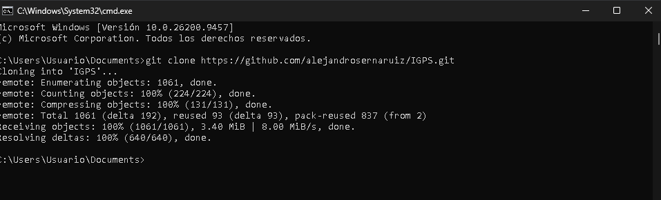
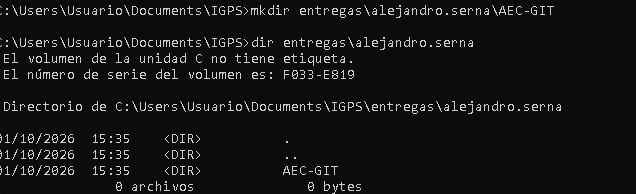
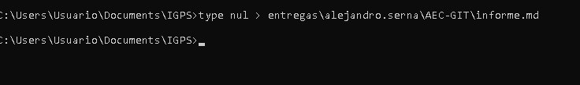
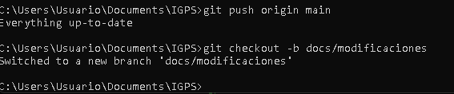
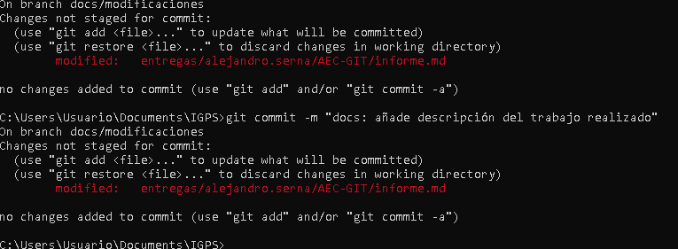

# AEC-GIT

## Autor

Alejandro Serna

## Introducción

En esta actividad se han utilizado Git y GitHub para trabajar con un repositorio, realizar un fork, clonarlo de forma local, crear una estructura de entrega, realizar commits y trabajar con distintas ramas.

---

## 1. Clonado del repositorio

Después de realizar el fork del repositorio de la asignatura en GitHub, cloné el repositorio en mi ordenador utilizando Git desde la terminal.

---

## 2. Comprobación del repositorio remoto

Una vez clonado el repositorio, comprobé mediante Git que el repositorio remoto `origin` correspondía con mi fork de GitHub.

---

## 3. Creación de la carpeta de entrega

Dentro de la carpeta `entregas` se creó la estructura correspondiente para realizar la actividad AEC-GIT.

La estructura utilizada fue:

`entregas/alejandro.serna/AEC-GIT`

---

## 4. Creación del informe

Dentro de la carpeta `AEC-GIT` se creó el archivo `informe.md`, que se utilizará para documentar los diferentes pasos realizados durante la actividad y mostrar las evidencias correspondientes.

El archivo fue añadido al seguimiento de Git y posteriormente se realizó el commit inicial indicado en el enunciado:

`docs: nuevo archivo`

---

## 5. Creación de la rama de trabajo

Después del commit inicial se creó una nueva rama denominada:

`docs/modificaciones`

Esta rama se utiliza para realizar los cambios relacionados con la documentación de la actividad sin trabajar directamente sobre la rama principal `main`.

---

### 6. Trabajo en la rama de documentación

Para realizar las modificaciones de la actividad se utilizó la rama
`docs/modificaciones`.

El trabajo se dividió en varios commits para mantener un historial
ordenado de los cambios realizados.

## 7. Historial de commits

Se utilizó el comando `git log --oneline --graph` para comprobar el historial de commits del repositorio.

De esta forma se pudo verificar que los cambios realizados en la rama `docs/modificaciones` se habían guardado correctamente en distintos commits.

---

## 8. Pull Request

Finalmente, se creó una Pull Request desde mi fork hacia el repositorio original de la asignatura para realizar la entrega de la actividad.