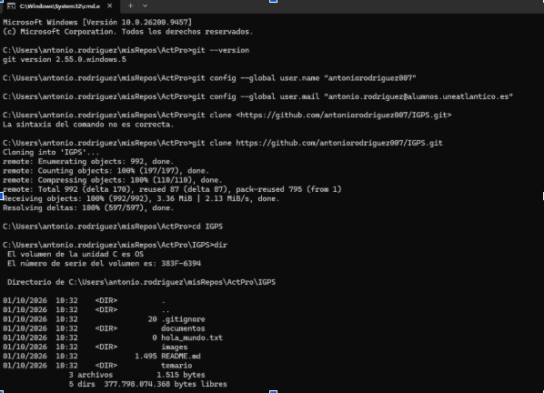
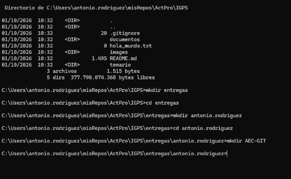
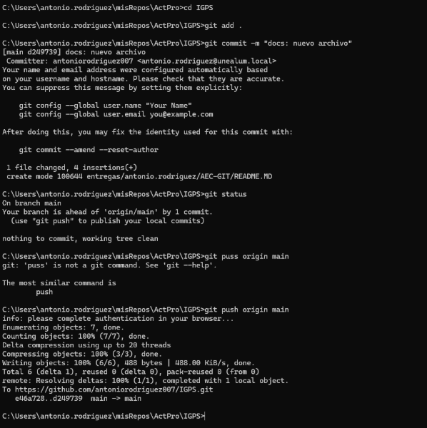
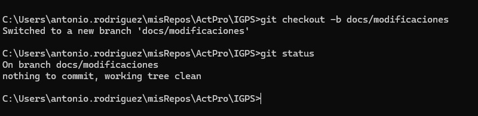

\*

Actividad 1 Gestion de Proyectos, Antonio Rodriguez

PASO 1:

En el paso 1 se hizo una clonación del repositorio original de Miguel Cabezon. Luego se agrego ese repo clonado en mi computadora local.

PASO 2:

En el paso 2 creamos la carpeta de entregas y adentro de esta tarjeta creamos una carpeta llamada Antonio.rodriguez, y luego adentro de esta misma carpeta se creo la carpeta llamada exactamente AEC-GIT

PASO 3:

En el paso 3 creamos un archivo de texto vacio README, luego añadimos el archivo al área de staging con git add para luego hacer un commit y finalmente subir todo lo que hemos hecho hasta este punto al repo remoto

PASO 4:

En el paso 4 nos fuimos a una nueva Branch llamada docs/modificaciones y comenzamos a editar el archivo de texto incuyendo las fotografías de todo lo que hemos hecho hasra este punto incluyendo una descripción como la que haciendo ahorita mismo, y haciendo un commit de cada modificación con mensajes de texto incluidos, luego subiremos esto al fork remoto.

