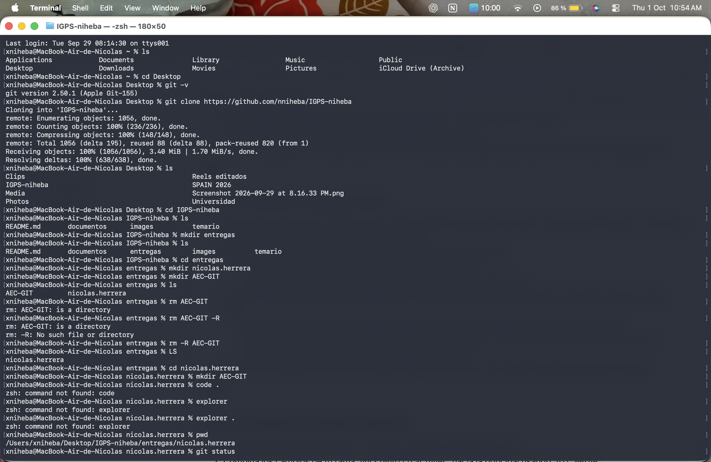
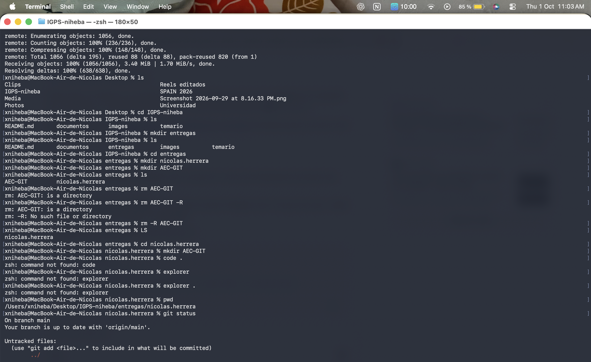
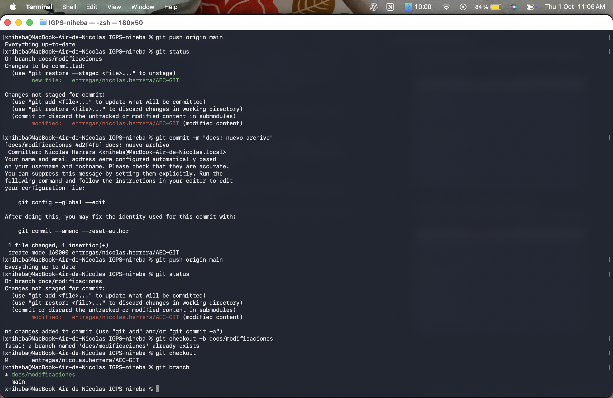
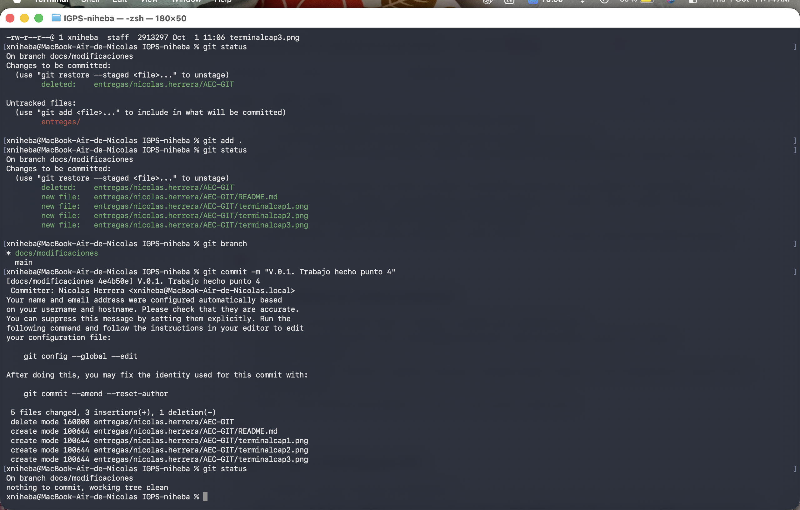

# Realizando la Actividad de Evaluación Continua - GIT

> Por Nicolás Herrera Barreto, 1 Octubre del 2026

## Capturas de mi terminal

Realizando desde la termianl MAC, ya que usualmente uso la terminal de Mac o Linux.

**Creando la carpeta y configurando las variables de entorno de GIT**

**Haciendo el commit del archivo, en los repoositorios como fueron indicados en la actividad**

**Haciendo el push al repo, y creando el nuevo branch**

**Creando ahora mis propios commits**

