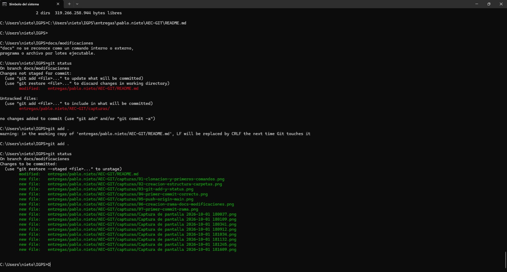
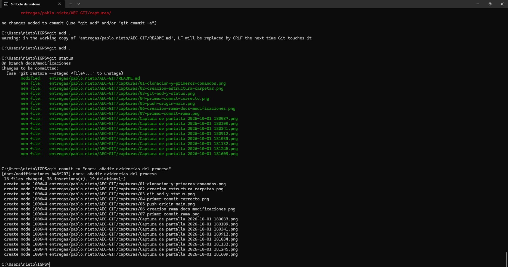
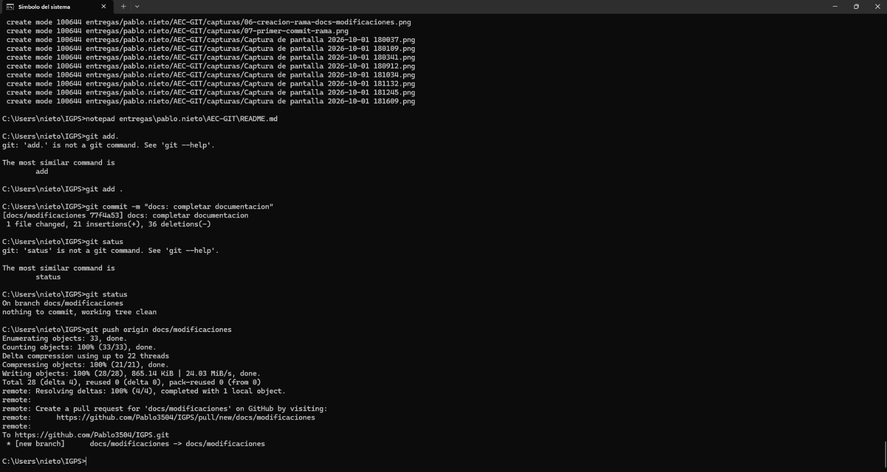
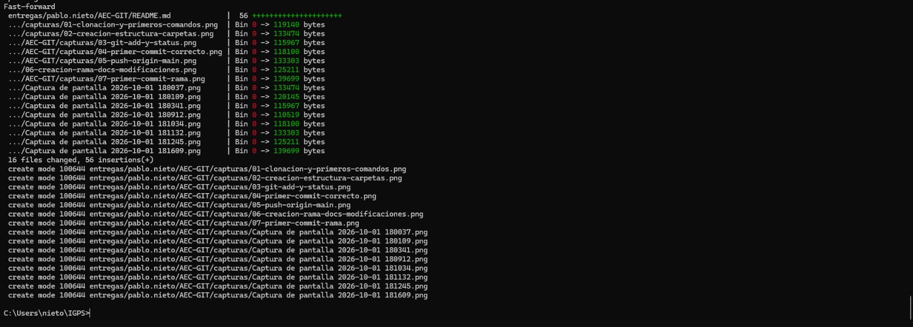
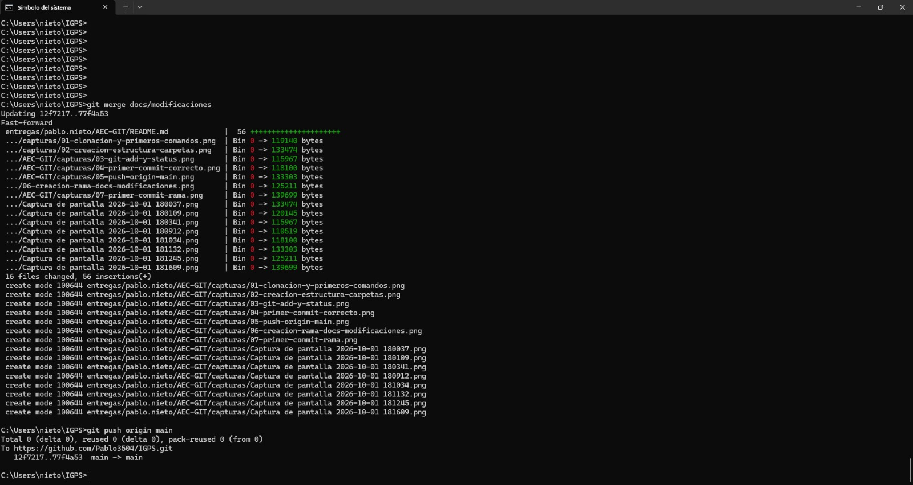

# Actividad de Evaluación Continua - GIT

**Alumno:** Pablo Nieto

## Introducción

En esta actividad he realizado un flujo básico de trabajo utilizando Git y GitHub. El objetivo ha sido practicar la creación de un fork, la clonación de un repositorio, la creación de carpetas y archivos, el uso de commits, ramas, merge y Pull Request, documentando cada etapa mediante capturas de pantalla.

## 1. Fork del repositorio

Primero realicé un fork del repositorio original proporcionado por el docente. De esta manera obtuve una copia del proyecto dentro de mi propia cuenta de GitHub.

> Añadir aquí una captura de GitHub donde se vea el fork creado antes de entregar.

## 2. Clonación del repositorio

Posteriormente cloné mi fork en el ordenador utilizando `git clone` para disponer de una copia local del proyecto.

## 3. Creación de la estructura de carpetas

Dentro del repositorio clonado creé desde CMD la estructura solicitada:

`entregas/pablo.nieto/AEC-GIT`

También creé el archivo `README.md`, utilizado para documentar el desarrollo de la actividad.

## 4. Primer commit y subida inicial

Añadí el archivo al área de staging mediante:

`git add .`

Después comprobé el estado del repositorio con `git status`.

A continuación realicé el primer commit con el mensaje exacto solicitado:

`git commit -m "docs: nuevo archivo"`

Posteriormente subí los cambios a la rama principal de mi fork mediante:

`git push origin main`

## 5. Creación de la rama de trabajo

Desde la rama principal creé una nueva rama llamada `docs/modificaciones` utilizando:

`git checkout -b docs/modificaciones`

## 6. Trabajo y commits en `docs/modificaciones`

En la rama `docs/modificaciones` fui incorporando la documentación y las evidencias de la actividad en diferentes partes, realizando varios commits descriptivos.

Los commits realizados durante esta etapa fueron:

- `docs: añadir introduccion de la actividad`
- `docs: añadir evidencias del proceso`
- `docs: completar documentacion`

Antes de realizar uno de los commits comprobé que el archivo `README.md` y las capturas estaban correctamente añadidos al área de staging.

Después realicé el commit destinado a incorporar las evidencias del proceso.

## 7. Subida de la rama al repositorio remoto

Una vez completados los cambios en la rama, comprobé que el repositorio no tenía cambios pendientes y subí `docs/modificaciones` a mi fork mediante:

`git push origin docs/modificaciones`

## 8. Merge con la rama principal

Después volví a la rama principal y combiné los cambios de `docs/modificaciones` con `main` mediante:

`git merge docs/modificaciones`

El merge se realizó correctamente mediante **Fast-forward**, por lo que no fue necesario resolver conflictos.

## 9. Subida final de `main`

Tras completar el merge, subí la rama principal actualizada a mi fork mediante:

`git push origin main`

De esta forma, `main` quedó actualizado con toda la documentación y las capturas desarrolladas en la rama de trabajo.

## 10. Pull Request

Como último paso se debe crear una Pull Request desde el fork hacia el repositorio original del docente.

La configuración debe utilizar:

- **Base repository:** repositorio original del docente.
- **Base branch:** `main`.
- **Compare repository:** mi fork.
- **Compare branch:** `docs/modificaciones`.

Antes de finalizar la entrega se debe añadir aquí una captura de la configuración de la Pull Request y otra captura de la Pull Request ya creada.

## Conclusión

Esta actividad me permitió practicar el flujo básico de trabajo con Git y GitHub. Durante el proceso trabajé con fork, clonación de repositorios, staging, commits, ramas, merge, push y Pull Request.

También comprobé la importancia de trabajar de forma ordenada con ramas y commits descriptivos, ya que permiten mantener un historial claro de los cambios realizados y facilitan la integración del trabajo en la rama principal.
