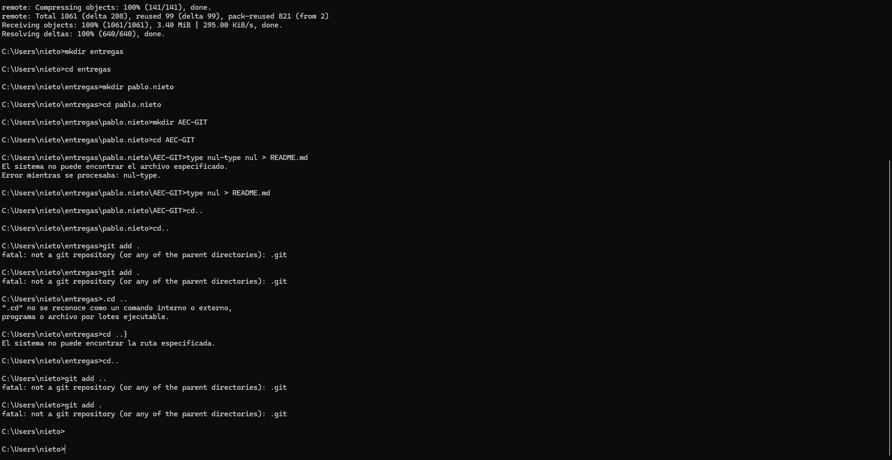
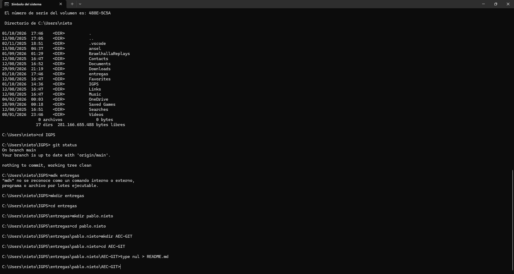
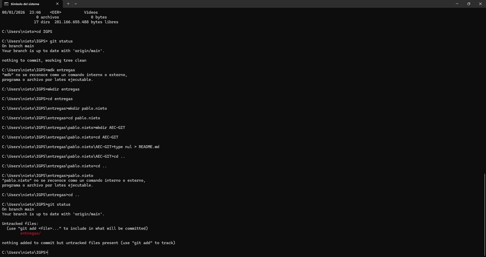
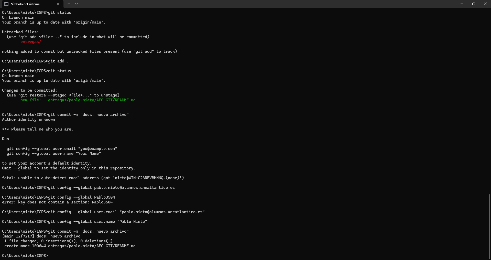
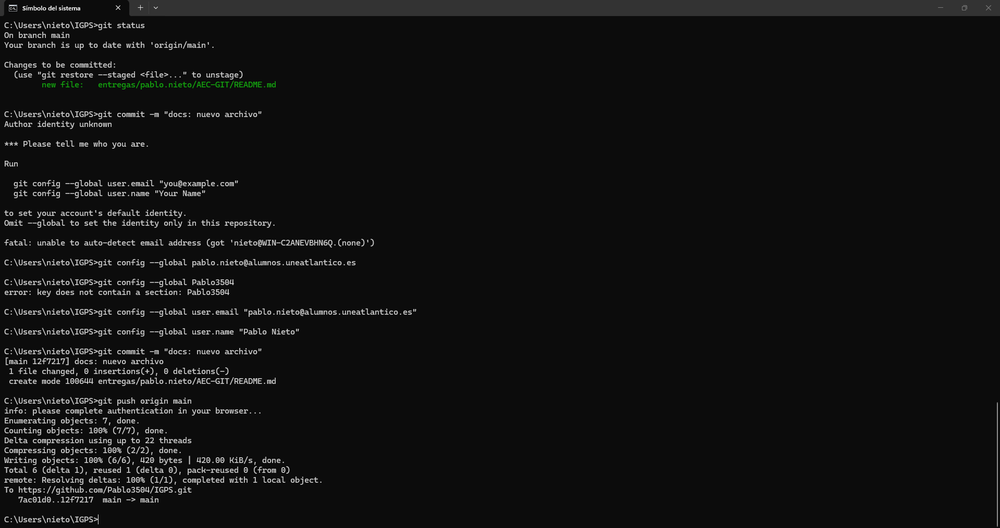
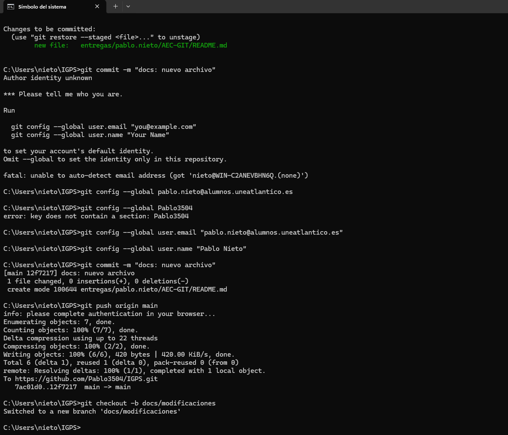
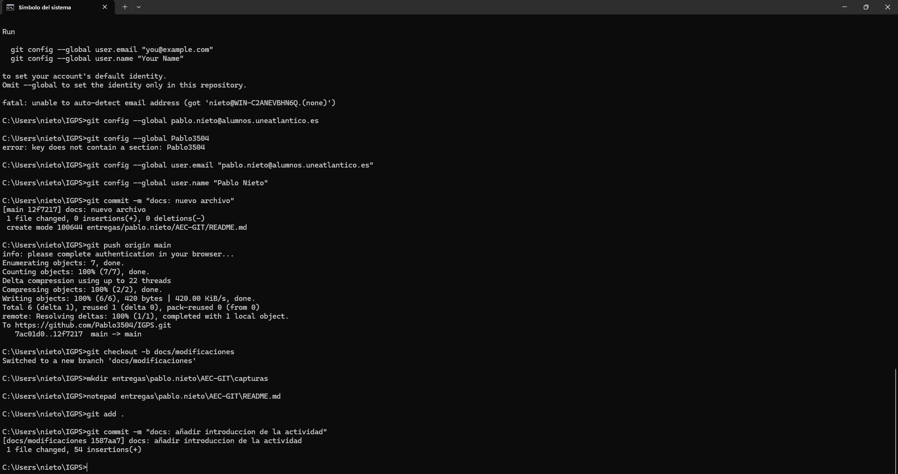

# Actividad de Evaluación Continua - GIT

**Alumno:** Pablo Nieto

## Introducción

En esta actividad he realizado un flujo básico de trabajo utilizando Git y GitHub. El objetivo ha sido practicar la creación de un fork, la clonación de un repositorio, la creación de la estructura solicitada, el uso de commits, ramas, merge y Pull Request.

## 1. Clonación del repositorio

Después de crear mi fork en GitHub, cloné el repositorio en mi ordenador para disponer de una copia local del proyecto.

> **Pendiente:** añadir una captura de la página de GitHub donde se vea claramente el fork creado, si todavía no la tienes guardada.

## 2. Creación de la estructura de carpetas

Dentro del repositorio local creé desde CMD la estructura solicitada:

`entregas/pablo.nieto/AEC-GIT`

También creé el archivo `README.md` para documentar el desarrollo de la actividad.

## 3. Primer commit y subida inicial

Añadí el archivo al área de staging con `git add .` y comprobé el estado del repositorio.

Después configuré la identidad de Git cuando fue necesario y realicé el commit obligatorio con el mensaje:

`docs: nuevo archivo`

Posteriormente subí los cambios a la rama principal de mi fork mediante:

`git push origin main`

## 4. Trabajo en la rama docs/modificaciones

Desde la rama principal creé una nueva rama llamada `docs/modificaciones` utilizando:

`git checkout -b docs/modificaciones`

En esta rama comencé a documentar el proceso mediante commits separados.

## 5. Continuación del trabajo

En la rama `docs/modificaciones` continuaré añadiendo las evidencias y explicaciones de la actividad mediante varios commits descriptivos, respetando el requisito de realizar entre 2 y 5 commits.

## 6. Merge

Al finalizar la documentación volveré a la rama `main` y combinaré los cambios de `docs/modificaciones` mediante `git merge docs/modificaciones`.

## 7. Pull Request

Como último paso crearé una Pull Request desde mi fork hacia la rama `main` del repositorio original del docente.

## Conclusión

La actividad permite practicar el flujo básico de Git y GitHub, incluyendo fork, clonación, staging, commits, ramas, merge, push y Pull Request.
