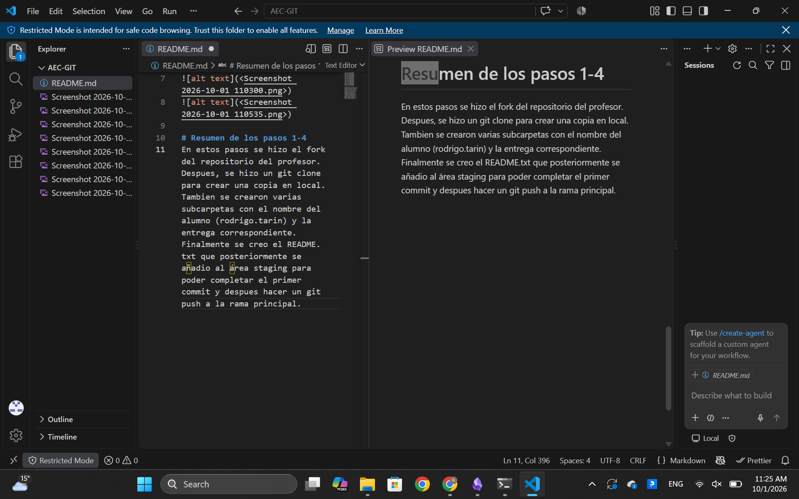

# Resumen de los pasos 1-4
En estos pasos se hizo el fork del repositorio del profesor. Despues, se hizo un git clone para crear una copia en local. Tambien se crearon varias subcarpetas con el nombre del alumno (rodrigo.tarin) y la entrega correspondiente. Finalmente se creo el README.txt que posteriormente se añadio al área staging para poder completar el primer commit y despues hacer un git push a la rama principal.

# Conclusiones
En conclusion este ejercicio sirvio para comprender de manera practica el funcionamiento de git junto con sus comandos como el git status, git add ., git commit -m, git branch. Al igual que conceptos como el Fork el Git clone y push  