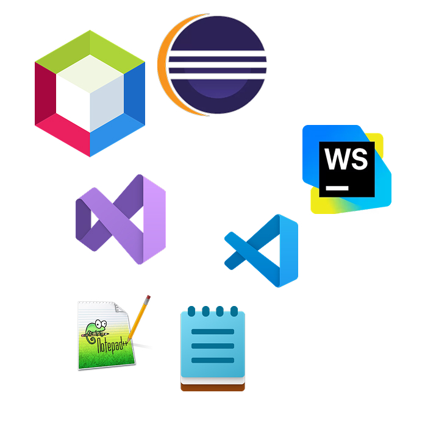

# IDEs

## ¿Qué es un IDE?

Un entorno de desarrollo integrado (*integrated development environment*) es un tipo de software que facilita el desarrollo a un programador para el desarrollo de otro software.

Habitualmente, los IDES contienen:
- Un editor de texto avanzado para código fuente.
- Un depurador (*debugger*) para identificar errores.
- Herramientas para compilar o previsualizar el resultado final.

Actualmente este tipo de software permite el uso de herramientas avanzadas cómo el uso de terminal, control de versiones, programación visual, etc...

**Ejemplos de programación visual:**
1. [Scratch](https://scratch.mit.edu/projects/editor/?tutorial=getStarted)
2. [Steamakers Blokcs](https://www.steamakersblocks.com/web/project/editordemo?id=1)
3. [Blueprints en Unreal Engine](https://dev.epicgames.com/documentation/en-us/unreal-engine/quick-start-guide-for-blueprints-visual-scripting-in-unreal-engine)
4. [Blockly@UNEATLANTICO](https://blockly.uneatlantico.es/)

## Historia de los IDEs

Hoy en día tenemos la ventaja de tener un entorno completamente adaptado a nosotros como desarrolladores y capaz de realizar gestiones complejas en el código. Esto no siempre fue así.

Periodos históricos de los IDEs:
1. [Paleolítico](https://es.wikipedia.org/wiki/Tarjeta_perforada): Tarjetas perforadas.
2. [Edad Antigua](https://www.techspot.com/images2/news/bigimage/2023/12/2023-12-05-image-14.jpg): Terminales de línea de comandos.
3. [Era Contemporánea/Cyberpunk](https://www.reddit.com/media?url=https%3A%2F%2Fi.redd.it%2F66cfc3xwzxxa1.jpg): Interfaces gráficas modernas

El primero de los entornos de desarrollo integrado que se puede definir como tal se creó en 1964. El **Dartmouth BASIC** fue diseñado y desarrollado en el Dartmouth College por John Kemeny y Thomas Kurtz durante ese mismo año e integraba en el propio sistema operativo la posibilidad de escribir, probar y ejecutar código en un mismo entorno. Otras fuentes declaran que el primer IDE fue el **[Maestro I](https://www.flickr.com/photos/caseorganic/4642200363)** que ya incluía [herramientas](https://en.wikipedia.org/wiki/Maestro_I#Technology) para depurar el código.

Ya a mediados de los 80 vemos una deriva hacia nuevos lenguajes de programación y hacia nuevas necesidades. Pascal y, tanto C (aunque venían de los 70) como C++, crecían en popularidad y conocimiento y llegaban a requerir entornos más productivos. **Turbo Pascal** fue de los primeros en incluir un compilador (venía en [cómodos disquets](https://keepcoding.io/wp-content/uploads/2024/08/28653358174_6cfe22806e_b.jpg)) o **Borland C++** que incluía mejoras en la depuración.

Llegamos al siglo XXI con el boom de las .com y el desarrollo web. Ya las aplicaciones no son sólo para hacer cuentas en tu ordenador, ahora puedes recibir datos a través de [APIs](https://free-apis.github.io/#/browse) de manera sencilla y crear aplicaciones y páginas para mostrar al mundo. También los lenguajes evolucionan, C y C++ (sobre todo este último) se actualiza para ofrecer mejoras tanto en rendimiento como en posibilidades y facilidades en el desarrollo. Aparecen lenguajes más sencillos (Java), o lenguajes enfocados a entornos web (Javascript), o incluso lenguajes incrustados en procesos del software (CI/CD). Esta miríada de lenguajes, provocó (y sigue provocando) una serie de derivas que bifurcan en dos vertientes:

 - Entornos más específicos y dependientes del lenguaje.
 - Entornos multilenguaje.

Pero tampoco hacen falta muchas cosas para escribir código. Puedes hacerlo con un simple bloc de notas.

**IDEs vs Editores Básicos**

| **IDEs**                              | **Editores Básicos**                      |
| ------------------------------------- | ----------------------------------------- |
| **Ventajas**                          | **Ventajas**                              |
| ✅ Autocompletado inteligente          | ✅ Arranque instantáneo                    |
| ✅ Depurador integrado                 | ✅ Consumo mínimo de recursos              |
| ✅ Gestión de proyectos                | ✅ Simplicidad de uso                      |
| ✅ Control de versiones integrado      | ✅ Personalización total                   |
| ✅ Detección de errores en tiempo real | ✅ Funciona en hardware limitado           |
| **Desventajas**                       | **Desventajas**                           |
| ❌ Consumo alto de memoria             | ❌ Sin autocompletado avanzado             |
| ❌ Arranque lento                      | ❌ Depuración manual                       |
| ❌ Curva de aprendizaje pronunciada    | ❌ Sin gestión de proyectos                |
| ❌ Interfaz compleja                   | ❌ Configuración manual extensa            |
| ❌ Algunos son de pago                 | ❌ Menos productivo para proyectos grandes |

### Panorama de IDEs

IDEs hay muchos. Unos más famosos y otros menos. Al final un IDE es bueno si te sirve a ti como ingeniero/a para realizar el desarrollo del proyecto de la manera más eficiente para ti y el proyecto concreto en el que estás trabajando.

Se pueden separar en tres categorías no oficiales pero que nos ayudan a elegir:

#### IDEs por lenguaje
Los IDEs por lenguaje se caracterizan por estar diseñados alrededor de un lenguaje o ecosistema en concreto, proporcionando una experiencia más completa y profunda, con herramientas enfocadas a el lenguaje objetivo. 

- **Java**: IntelliJ IDEA, Netbeans o Eclipse.
- **C# y .NET**: Visual Studio.
- **Android**: Android Studio.

#### IDEs multiplataforma/multilenguaje
Cuando queremos algo entre un editor de texto básico y un IDE pudiendo llegar a establecer un entorno de desarrollo completo a través de la instalación de extensiones, entonces necesitaremos un IDE multiplataforma/multilenguaje.

Este tipo de IDEs no sólo están pensados para poder trabajar con distintos lenguajes, sino que también en distintos sistemas operativos. Ejemplos, Visual Studio Code o Sublime Text.

En este curso nos centraremos en *Visual Studio Code*.

#### IDEs web/online
Los IDEs web/online es software cuya principal ventaja es la de tener un entorno completo accesible desde un navegador, sin la necesidad de instalar nada. Ejemplos son CodePen o GitHub Codespaces.

## Visual Studio Code

Podéis descargar Visual Studio Code [aquí](https://code.visualstudio.com)

#### Extensiones esenciales
- Toda aquella instalación oficial del lenguaje objetivo. Aquí tenéis algunos ejemplos:
	- [C/C++](https://marketplace.visualstudio.com/items?itemName=ms-vscode.cpptools)
	- [C#](https://marketplace.visualstudio.com/items?itemName=ms-dotnettools.csharp)
	- [Lua](https://marketplace.visualstudio.com/items?itemName=sumneko.lua)
	- [Python](https://marketplace.visualstudio.com/items?itemName=ms-python.python)
- Extensiones de autocompletado
- Extensiones de formateo:
	- [Prettier](https://marketplace.visualstudio.com/items?itemName=esbenp.prettier-vscode)
- [Live Server](https://marketplace.visualstudio.com/items?itemName=ritwickdey.LiveServer): Despliegue local rápido para visualizar páginas web.
- [indent-rainbow](https://marketplace.visualstudio.com/items?itemName=oderwat.indent-rainbow): Ayuda para la visaulización de indentación
- [CodeSnap](https://marketplace.visualstudio.com/items?itemName=adpyke.codesnap): Saca capturas bonitas del código (útil para trabajos).
- Temas para tener colores bonitos:
	- [eppz!](https://marketplace.visualstudio.com/items?itemName=eppz.eppz-code)
	- [Tokyo Night](https://marketplace.visualstudio.com/items?itemName=enkia.tokyo-night)

#### Atajos y funcionalidades clave
- Autocompletado y sugerencias `Ctrl + Space`
- Depuración paso a paso `F5`
- Control de versiones integrado (a través de extensiones)
- Terminal integrada (con opción de tener varías) `Ctrl + Ñ`
- Búsqueda y remplazo avanzado `Ctrl + H`
- Búsqueda de archivos e inicio de procesos rápida `Ctrl + P para buscar, > para buscar procesos`

#### Consejos de uso
1. **Minimalismo**: Instala solo las extensiones estrictamente necesarias. Cada extensión adicional consume recursos y puede ralentizar el editor.
2. **Seguridad**: Prioriza siempre las extensiones oficiales publicadas por Microsoft o los equipos de desarrollo del lenguaje. Si buscas alternativas, valora el número de descargas y las reseñas.
3. **Evita distracciones**: Evita extensiones decorativas (como mascotas animadas); consumen CPU/GPU innecesariamente y restan foco al desarrollo.

