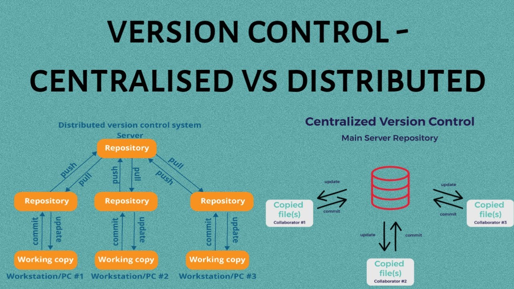
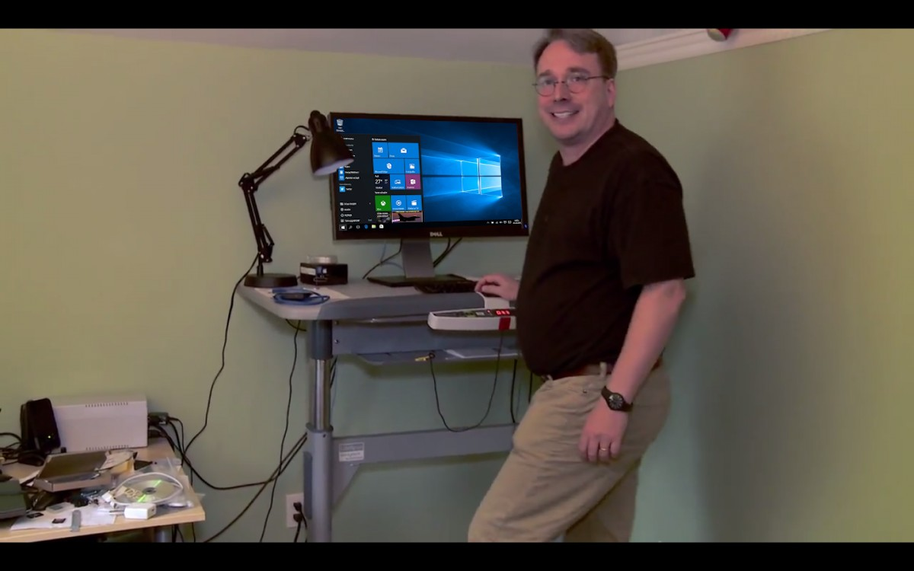

# GIT

## Control de Versiones
Un **sistema de control de versiones** es una herramienta que registra los cambios realizados en archivos a lo largo del tiempo, permitiendo recuperar versiones específicas cuando sea necesario. Es como tener un "historial de cambios" detallado de tu proyecto.

## Tipos de Sistemas de Control de Versiones

### **1. Sistemas Locales**
- Guardan versiones en tu computadora.
- **Problema**: No hay colaboración, riesgo de pérdida de datos.
- **Ejemplo**: RCS (Revision Control System)

### **2. Sistemas Centralizados**
- Un servidor central almacena todas las versiones.
- Los desarrolladores descargan archivos del servidor.
- **Ejemplos**: SVN (Subversion), Perforce, CVS.
- **Problemas**:
    - Si el servidor falla, nadie puede trabajar.
    - Punto único de falla.
    - Dependencia de conexión a internet.

### **3. Sistemas Distribuidos (Como Git)**
- Cada desarrollador tiene una **copia completa** del historial.
- No hay un punto central único.

## Representación Visual



## GIT - Fundamentos

### ¿Qué es Git?
Git es un software de control de versiones diseñado por Linus Torvalds. Enfocado a la eficiencia y la compatibilidad de versiones en archivos de código, su propósito es llevar registro de los cambios incluyendo coordinar el trabajo que varias personas realizan sobre archivos compartidos en un repositorio de código.

Gratis, de código abierto y compatible para proyectos tanto grandes cómo pequeños.




### Git y GitHub
**GitHub** es una forja (plataforma de desarrollo colaborativo) para alojar proyectos utilizando el sistema de control de versiones Git. Se utiliza principalmente para la creación de código fuente de programas de ordenador.

Podéis acceder a GitHub a través de este [enlace](https://github.com).

### Instalación

Para instalar GIT en Windows, se puede descargar la última versión [aquí](https://git-scm.com). Si usáis algún sistema operativo Linux, podéis usar el siguiente comando:

```
sudo apt install git-all
```

Para ver si está instalado correctamente, sólo hay que acceder al terminal e introducir el siguiente comando:

```
git --version
```


### Configuración inicial
Por su naturaleza colaborativa, Git utiliza un sistema de cuentas para poder conocer quién ha realizado los cambios en los archivos.
Para poder usar Git sin que te pida la contraseña en cada acción debemos configurarlo en un inicio con nuestras credenciales:

```
git config --global user.name "Tu Nombre" # Usuario de Git
git config --global user.email "tu@email.com" # Email de Git
git config --list # Lista los usuarios (opcional)
```


### Conceptos básicos

#### Los tres entornos de Git

**Working directory (Directorio de trabajo)**

Este es el directorio/carpeta en el que el ingeniero trabaja, ya sea para cambiar líneas de código, añadir o eliminar archivos, ...

Dentro de esta carpeta, aparte del proyecto a trabajar, tendremos la carpeta oculta *.git* que tiene toda la información sobre el repositorio local y remoto y sus ramas.

Un ejemplo de proyecto con Git sería:
```
mi-proyecto/ 
├── .git
├── index.html
├── style.css
└── script.js
```

Dato: El nombre de la carpeta "mi-proyecto" es el nombre del repositorio de Git.

**Staging Area (Área de "Preparación")** 

El *Staging Area* es un área intermedia al que iremos añadiendo los archivos que has modificado con el objetivo de preparar tu próximo *commit*.

Para añadir archivos al staging area sólo necesitaréis el siguiente comando:

```
git add index.html # Para un solo archivo
git add * # Para incluir al commit todo lo modificado
```


**Repositorio (carpeta .git)**

El repositorio guarda todas las modificaciones y versiones de forma permanente en el historial de git. Esta carpeta es la que va a coordinar con el repositorio remoto (GitHub, por ejemplo) para que se pueda acceder de manera remota.

Para añadir los cambios preparados en la staging area, debemos hacer un commit con el siguiente comando:

```
git commit -m "Add homepage design" # -m Indica el mensaje que vas a escribir entre comillas
```


#### Estados
Cuando ejecutamos el comando `git status` nos va a devolver una serie de estados por archivo. Cada uno tiene su significado:

- **Untracked**: El archivo con este estado es nuevo y no está añadido a git.
- **Modified**: Está en git y detecta cambios en el archivo.
- **Staged**: El archivo está en el *staging area*.
- **Commited**: El archivo está en el repositorio, registrado en el historial de git.

**---Ejercicio práctico---**
- Crear proyecto HTML simple
- Hacer 5 commits diferentes
- Explorar git log y git status

#### Diagrama de flujo
Git basa su organización en función a las ramas. ¿Pero qué son las ramas?
Las **ramas (branches)** son líneas independientes de desarrollo que te permiten trabajar en diferentes características o experimentos sin afectar el código principal.

Poniendo como analogía a un árbol, podemos decir que:

- **Tronco principal**: La rama `main` es código estable. A veces llamado `prod` o  `master`.
- **Ramas**: Diferentes direcciones de crecimiento. Ejemplos de ramas pueden ser `fix`, `beta`, `int` (integración)
- **Hojas**: Serían los commits individuales.
- **Merge**: Cuando una rama se une de vuelta al tronco.


#### Repositorio remoto


**SSH vs HTTPS**

SSH (Sedcure Shell) es el nombre de un protocolo cuya función principal es la de conectar con un servidor remoto a travésd de un canal seguro dónde toda la información es cifrada.
HTTPS es el protocolo seguro de transferencia de hipertexto que utiliza en su cifrado SSL para establecer un canal seguro gracias a la identificación por usuario y contraseña. Hoy en día este protocolo es el estándar y recomendado para cualquier página o aplicación web.

| Característica               | SSH                                          | HTTPS                                       |
| ---------------------------- | -------------------------------------------- | ------------------------------------------- |
| Autenticación             | Por clave pública/privada                    | Por usuario y contraseña (o token personal) |
| Seguridad                 | Muy segura (uso de criptografía asimétrica)  | Segura (usa SSL/TLS)                        |
| Configuración             | Requiere generar e instalar claves           | Más simple, sin configuración inicial       |
| Uso repetido              | No pide credenciales cada vez (usa la clave) | Puede pedir usuario/token en cada push      |
| Firewalls/Proxies         | Puede estar bloqueado por algunas redes      | Funciona casi siempre (puerto 443)          |
| Experiencia de usuario | Ideal para desarrolladores frecuentes        | Mejor para principiantes o usos esporádicos |


**¿Cuándo usar SSH?**

- Eres desarrollador frecuente y trabajas con Git todos los días.
- Quieres evitar ingresar tu usuario/contraseña/token cada vez. (Tiene truco).
- Tu red permite el puerto 22 (usado por SSH).
- Tienes experiencia configurando claves SSH.

**Ventajas**
- Más seguro a largo plazo.
- Automatizable (por ejemplo, en scripts CI/CD).

**Desventajas**
- Requiere configuración inicial (claves, agente SSH).


**¿Cuándo usar HTTPS?**

- Estás comenzando con Git o es un uso ocasional.
- Estás detrás de un proxy o firewall restrictivo.
- Quieres una configuración rápida y sencilla.

**Ventajas**

- Compatible con casi todas las redes.
- Fácil de usar al principio.

**Desventajas**

- Puede requerir ingresar credenciales frecuentemente (aunque puedes usar un credential helper o un token).

### REPOSITORIO REMOTO

El repositorio remoto es el directorio alojado en cualquier servicio en línea. Este, será modificado en función de los commits de los desarrolladores implicados. Muchos de estos servicios también ofrecen herramientas de seguridad y gestión para adaptarlos a tu negocio o proyecto.

Los más conocidos son GitHub y GitLab, pero también se podría considerar un repositorio remoto a Google Drive.

Para conectar el repositorio local con el remoto primero deberemos crear una cuenta en GitHub (dónde trabajaremos a partir de ahora), y crear el repositorio.
Luego, desde la línea de comandos, ejecutaremos el siguiente comando:
`git remote add origin <URL_REPO>`

**Nota de estándares**: El argumento de origin en el comando simboliza el nombre que recibe el repositorio remoto, es buena práctica dejarlo así. También, puede haber veces en el que la rama principal del repositorio se llame "master" o "main" de manera por defecto (de hecho, es una configuración modificable en GitHub). Esto se debe a que en los últimos 10 años se ha ido hacia el uso del nombre "main" en la rama principal por varias razones. La primera es la estandarización por defecto de nombres, ya que puedes llamarla también "prod", "stable", etc... (todo depende del proyecto). Y la segunda es que la palabra "master" tiene connotaciones culturales negativas.

Ahora, una vez establecido el repositorio remoto, ya podemos subir todo lo guardado en commits con el siguiente comando:

`git push -u origin main` o simplemente `git push`

Si no hay fallos en el terminal los cambios deberían estar aplicados en el repositorio remoto.

**LA INVERSA**
Ahora, ¿qué pasa cuando queremos crear el repositorio en GitHub y descargarlo en nuestro ordenador?

Más fácil aún. Sólo tendremos que ir a través de terminal a nuestro directorio de proyectos y escribir `git clone <URL_REPO>`.
Una vez hecho ya estaría todo listo para empezar a hacer cambios.

Si te has equivocado al establecer el repositorio remoto, puedes cambiar la url de la siguiente manera: `git remote set-url origin <URL_REPO>`

**TRABAJO COLABORATIVO**
Imáginate que tú y tu compañero de equipo estáis trabajando en la misma rama en un mismo archivo. El trabaja por la mañana y tú por la tarde. Sabes que ha subido sus cambios y ahora quieres tenerlos en local para seguir avanzando en el trabajo. Fácil, sólo tienes que ejecutar el siguiente comando, `git pull`, y los cambios se te descargarán a tu repositorio local.
Los conflictos es algo que veremos en la siguiente lección.


#### El Formato
Como cuando cada lenguaje, patrón de diseño o tipo de proyecto tiene su formato de carpetas y archivos, Git también tiene el suyo. Puede variar de proyecto en proyecto pero aquí tenéis algunas convenciones:

**CONVENCIONES GENERALES**

Sea como sea tu proyecto asegúrate de cumplir las siguientes normas:

- **Minúsculas y separación por guiones:** Siempre escribe todo en minúsculas y separado por un guión (-).
- **Sólo caracteres alfanuméricos y guión:** Ni espacios, ni barras bajas, etc, etc...
- **Sólo un único guión**: Usar más de un guión puede ser confuso.
- **No terminar con un guión**
- **Descriptivos:** Con un vistazo deberíamos saber sobre qué trata la rama/commit.

**MENSAJE DE COMMITS**


Más información sobre el formato de los commits [aquí](https://gist.github.com/qoomon/5dfcdf8eec66a051ecd85625518cfd13).


### Más información
#### Comandos útiles

- `git log` Muestra el historial 
- `git diff` Muestra los cambios
- `git remote -v` Muestra los repositorios remotos configurados


Si queréis saber más sobre Git y sus posibilidades, [aquí tenéis la documentación](https://git-scm.com/doc).

