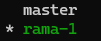

# GIT SEASON 2

## Diagrama de flujo

Git basa su organización en función a las ramas. ¿Pero qué son las ramas?
Las **ramas (branches)** son líneas independientes de desarrollo que te permiten trabajar en diferentes características o experimentos sin afectar el código principal.

Poniendo como analogía a un árbol, podemos decir que:

- **Tronco principal**: La rama `main` es código estable. A veces llamado `prod` o `master`.
- **Ramas**: Diferentes direcciones de crecimiento. Ejemplos de ramas pueden ser `fix`, `beta`, `int` (integración)
- **Hojas**: Serían los commits individuales.
- **Merge**: Cuando una rama se une de vuelta al tronco.


## Repositorio remoto

### SSH vs HTTPS

SSH (Sedcure Shell) es el nombre de un protocolo cuya función principal es la de conectar con un servidor remoto a travésd de un canal seguro dónde toda la información es cifrada.
HTTPS es el protocolo seguro de transferencia de hipertexto que utiliza en su cifrado SSL para establecer un canal seguro gracias a la identificación por usuario y contraseña. Hoy en día este protocolo es el estándar y recomendado para cualquier página o aplicación web.

| Característica         | SSH                                          | HTTPS                                       |
| ---------------------- | -------------------------------------------- | ------------------------------------------- |
| Autenticación          | Por clave pública/privada                    | Por usuario y contraseña (o token personal) |
| Seguridad              | Muy segura (uso de criptografía asimétrica)  | Segura (usa SSL/TLS)                        |
| Configuración          | Requiere generar e instalar claves           | Más simple, sin configuración inicial       |
| Uso repetido           | No pide credenciales cada vez (usa la clave) | Puede pedir usuario/token en cada push      |
| Firewalls/Proxies      | Puede estar bloqueado por algunas redes      | Funciona casi siempre (puerto 443)          |
| Experiencia de usuario | Ideal para desarrolladores frecuentes        | Mejor para principiantes o usos esporádicos |

### ¿Cuándo usar SSH?

- Eres desarrollador frecuente y trabajas con Git todos los días.
- Quieres evitar ingresar tu usuario/contraseña/token cada vez. (Tiene truco).
- Tu red permite el puerto 22 (usado por SSH).
- Tienes experiencia configurando claves SSH.

#### Ventajas

- Más seguro a largo plazo.
- Automatizable (por ejemplo, en scripts CI/CD).

#### Desventajas

- Requiere configuración inicial (claves, agente SSH).

### ¿Cuándo usar HTTPS?

- Estás comenzando con Git o es un uso ocasional.
- Estás detrás de un proxy o firewall restrictivo.
- Quieres una configuración rápida y sencilla.

#### Ventajas

- Compatible con casi todas las redes.
- Fácil de usar al principio.

#### Desventajas

- Puede requerir ingresar credenciales frecuentemente (aunque puedes usar un credential helper o un token).

## REPOSITORIO REMOTO

El repositorio remoto es el directorio alojado en cualquier servicio en línea. Este, será modificado en función de los commits de los desarrolladores implicados. Muchos de estos servicios también ofrecen herramientas de seguridad y gestión para adaptarlos a tu negocio o proyecto.

Los más conocidos son GitHub y GitLab, pero también se podría considerar un repositorio remoto a Google Drive.

Para conectar el repositorio local con el remoto primero deberemos crear una cuenta en GitHub (dónde trabajaremos a partir de ahora), y crear el repositorio.
Luego, desde la línea de comandos, ejecutaremos el siguiente comando:
`git remote add origin <URL_REPO>`

**Nota de estándares**: El argumento de origin en el comando simboliza el nombre que recibe el repositorio remoto, es buena práctica dejarlo así. También, puede haber veces en el que la rama principal del repositorio se llame "master" o "main" de manera por defecto (de hecho, es una configuración modificable en GitHub). Esto se debe a que en los últimos 10 años se ha ido hacia el uso del nombre "main" en la rama principal por varias razones. La primera es la estandarización por defecto de nombres, ya que puedes llamarla también "prod", "stable", etc... (todo depende del proyecto). Y la segunda es que la palabra "master" tiene connotaciones culturales negativas.

Ahora, una vez establecido el repositorio remoto, ya podemos subir todo lo guardado en commits con el siguiente comando:

`git push -u origin main` o simplemente `git push`

Si no hay fallos en el terminal los cambios deberían estar aplicados en el repositorio remoto.

### LA INVERSA
Ahora, ¿qué pasa cuando queremos crear el repositorio en GitHub y descargarlo en nuestro ordenador?

Más fácil aún. Sólo tendremos que ir a través de terminal a nuestro directorio de proyectos y escribir `git clone <URL_REPO>`.
Una vez hecho ya estaría todo listo para empezar a hacer cambios.

Si te has equivocado al establecer el repositorio remoto, puedes cambiar la url de la siguiente manera: `git remote set-url origin <URL_REPO>`

### TRABAJO COLABORATIVO
Imáginate que tú y tu compañero de equipo estáis trabajando en la misma rama en un mismo archivo. El trabaja por la mañana y tú por la tarde. Sabes que ha subido sus cambios y ahora quieres tenerlos en local para seguir avanzando en el trabajo. Fácil, sólo tienes que ejecutar el siguiente comando, `git pull`, y los cambios se te descargarán a tu repositorio local.
Los conflictos es algo que veremos en la siguiente lección.


## Ramas
Hasta ahora hemos visto una única rama, la rama principal llamada *main* o *master* (aunque ya hemos visto que pueden tener otros nombres dependiendo del proyecto). Pero trabajar sobre una sola rama es peligroso. Podemos romper algo y que no sea recuperable a través de revertir commits. O peor aún, tu producto es una red social y se rompe durante unos segundos, así que toda la empresa pierde varios millones mientras está sin servicio.

Para ello, antes de desarrollar cualquier funcionalidad (o de arreglar cualquier problema) es altamente recomendable (por no decir obligatorio) crear una rama nueva.

Para ver las ramas que tenemos actualmente podemos usar `git branch` y nos mostrará una lista con las ramas y nos marcará en cuál tenemos apuntando nuestro puntero HEAD (es decir, dónde nos encontramos realizando cambios).



Para crear una rama deberemos usar el comando `git checkout -b <nombre_rama>`. Atención porque la nueva rama tendrá los últimos cambios de la rama en la que esté situado el puntero HEAD al momento de crear la nueva rama. Por ejemplo, tenemos dos ramas *main* y *beta*. Queremos crear una funcionalidad para nuestro entorno beta que ayude a los desarrolladores,

Para eliminar una rama tanto en local como en remoto podemos usar los siguientes comandos:
```
git push -d <nombre_remoto> <nombre_rama>   # Elimina rama en remoto (nombre_remoto suele ser origin)
git branch -d <nombre_rama>               # Elimina rama en local
```

Para cambiar vuestra rama por defecto, tendréis que cambiar las configuración de Git a través del siguiente comando:
```
git config --global init.defaultBranch {nombre_rama}
```


Encontraréis información más profunda sobre las ramas en la documentación de Git [aquí](https://git-scm.com/book/en/v2/Git-Branching-Basic-Branching-and-Merging).

#### Ramas de entorno: Estas ramas se utilizan para separar entornos o fases del desarrollo

Ejemplos:
```
  beta
  int
  dev
```


#### Feature Branches (Ramas de Funcionalidad): Estas ramas se utilizan para desarrollar nuevas características o funcionalidades. 

Prefijo: `feature` o `feat` 

Ejemplos: 
```
feature/login-system # Sistema de login 
feature/shopping-cart # Carrito de compras
```

#### Bugfix Branches (Ramas de Corrección de Errores): Estas ramas se utilizan para corregir errores en el código existente. 

Prefijo: `bugfix` o `fix` 

Ejemplos:
```
bugfix/mobile-responsive # Problemas de responsive 
bugfix/database-connection # Error de conexión a BD
```

#### Hotfix Branches (Ramas de Corrección Urgente): Estas ramas se crean directamente desde la rama de producción para corregir errores críticos en el entorno de producción.

Prefijo: `hotfix/`

Ejemplos:
```
hotfix/data-corruption # Corrupción de datos 
hotfix/server-crash # Caída del servidor 
hotfix/memory-leak # Fuga de memoria
```

#### Release Branches (Ramas de Lanzamiento): Estas ramas se utilizan para preparar un nuevo lanzamiento a producción. Permiten hacer los ajustes finales y pulir detalles.

Prefijo: `release/`

Ejemplos:
```
release/v2.1.0 # Versión 2.1.0 
release/2024-march # Release de marzo 2024 
release/sprint-15 # Release del sprint 15
```


#### Documentation Branches (Ramas de Documentación): Estas ramas se utilizan para escribir, actualizar o corregir documentación, como archivos README.md, wikis, o documentación de API.

Prefijo: `docs/`

Ejemplos:
```
docs/api-endpoints # Documentar endpoints de API 
docs/installation-guide # Guía de instalación
```
