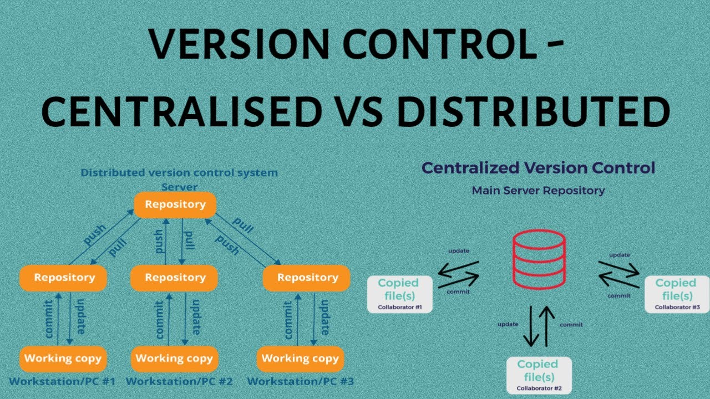
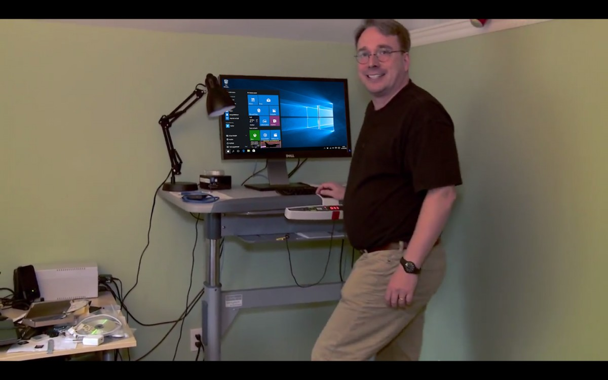
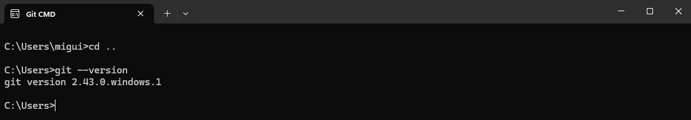
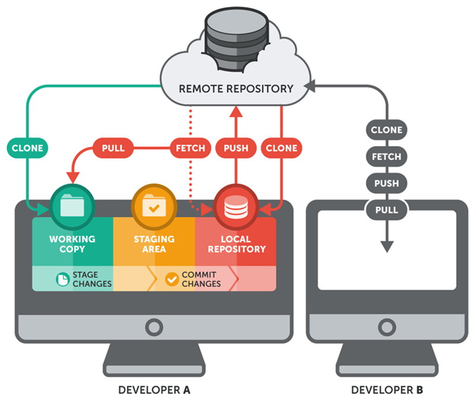

# GIT

## Version Control

A **version control system** is a tool that records changes made to files over time, allowing specific versions to be restored when necessary. It is like having a detailed "change history" of your project.

## Types of Systems

| Type | Description | Examples | Main Disadvantages |
|--|--|--|--|
|**Local**|Versions are stored only on your local computer.|RCS (Revision Control System)|No collaboration; high risk of data loss.|
|**Centralized**|A central server stores all versions. Developers work against this single node.|SVN (Subversion), Perforce, CVS|Single point of failure; complete dependency on an internet connection.|
|**Distributed**|Each developer has a complete copy of the history. There is no mandatory central point.|Git|Higher initial learning curve|




---

## What is Git?

**Git** is free, open-source, and extremely efficient version control software. It was designed by Linus Torvalds to manage the development of the Linux kernel, although it is now used in projects of all sizes.

Its purpose is twofold:
1. Keep an accurate record of changes made to the code.
2. Coordinate the collaborative work of multiple people on the same repository.

### Git vs. GitHub

It is common to confuse both terms at first, but they are different things:

- **Git** is the command-line tool that you install on your machine. It manages the history locally.
- **GitHub** is a forge (collaborative development platform) for hosting projects using the Git version control system. It is primarily used for creating and hosting computer program source code. You can access GitHub through this [link](https://github.com).

## History of Git

In the early 2000s, the Linux kernel was beginning to become quite large. Versions were managed using patches sent via email describing the changes made to the files. At the same time, many developers contributing to the project were using Beekeeper as a source code management tool.

In 2005, Beekeeper removed its free version, citing contract violations because several Linux developers had modified the software, unlocking paid features. This dispute between the Beekeeper team and Linux led Linus Torvalds, the initiator and an important contributor to Linux, to design a new version control system that was as free as Linux itself was (and still is).

And so Git was born.




## Installation and Initial Configuration

### Installation
- **Windows/macOS/Linux**: Download the latest official version from [git-scm.com](https://git-scm.com).
- **Linux (Debian/Ubuntu)**: You can also use the package manager:
```bash
sudo apt install git-all
```

To check whether it has been installed correctly, simply open the terminal and enter the following command:

```bash
git --version
```



### Global Configuration

Due to its collaborative nature, Git uses an account system to identify who has made changes to files.

To use Git without being asked for your credentials for every action, you should configure your credentials initially:

```bash
# Set your username
git config --global user.name "Your Name"

# Set your email
git config --global user.email "your@email.com"

# Check the current configuration
git config --list
```


## Key Concepts: The Three Git Environments



To understand how Git works, you need to visualize three areas where your files reside:


### Working Directory

- This is the directory/folder where the developer works, whether they are modifying lines of code, adding or deleting files, etc.

- Inside this folder, in addition to the project itself, we will have the hidden _.git_ folder, which contains all the information about the repository's history and metadata.

A Git project would look like this:

```
my-project/
├── .git        # Hidden folder containing the history
├── index.html
├── style.css
└── script.js
```

Note: The name of the "my-project" folder is the name of the Git repository.

### Staging Area (Index)

The _Staging Area_ is an intermediate area where we add the changes we specify in order to prepare our next _commit_. This allows us to logically group changes before recording them in the history.

To add files to the staging area, you only need the following command:

```bash
git add index.html # For a single file
git add * # To include everything modified in the commit
```

### Repository (.git folder)

The repository permanently stores all modifications and versions in Git's history. This folder is responsible for coordinating with the remote repository (GitHub, for example).

We can think of each commit as a unique version of the repository.

To add the changes prepared in the staging area, we must create a commit using the following command:

```bash
git commit -m "Add homepage design" # -m Indicates the message you want to write inside the quotes
```

> [!TIP]
> If you want to simplify the process, you can use the `git commit -am "<message>"` command. The additional `a` moves the changes to the Staging Area before the commit.
> However, this command only works **for changes to existing files**. It does **not** work for new files.

### What is HEAD?

`HEAD` is a pointer that always points to the latest commit of the branch you are currently on. It represents your current position in the history.


### States and Change History

#### Check Status (`git status`)

This command tells you the current state of your files in the history:

- **Untracked**: The file is new and Git is not tracking it.
- **Modified**: The file is tracked by Git and changes have been detected, but it has not been added to the staging area.
- **Staged**: The file is in the _staging area_ and ready to be committed.
- **Committed**: The file is in the repository and recorded in Git's history.

#### Change History — git log, git show and git diff

With `git log`, we can view the commits made in the repository along with their unique IDs and other relevant information. If we want to see a simplified version of these records, we can use `git log --oneline`.

With `git show <id_commit>`, we can view the details of a commit.

Finally, with `git diff`, we can view changes that have not yet been added to the Staging Area. To view changes in the Staging Area, we use `git diff --staged`.


#### Custom Commands — git alias

*Tired of typing long commands all day?* You can create your own commands with `git alias`. Git aliases are another configuration option that allows you to create custom commands.

For example, we can create an alias for the `git status` command by running the following command:

```bash
git config --global alias.st status
```

Now, whenever you want to check the repository status, you can run `git st`.

Another example would be simplifying the `git log --oneline` command. We can configure it with:

```bash
git config --global alias.logone "log --online"
```

(NOTE: Be careful to include the quotation marks because we have added the `--oneline` parameter).


### Reverting Changes and Managing Commits

Imagine the following situation. We are working and make several commits, but at some point, we realize that we have an error that we introduced several commits ago and have no idea how to go back.

There are several ways to handle this, and we need to consider what we want to do or undo and which areas will be affected by the restoration.

#### `git reset`

This is a powerful command that rewrites the commit history. It has three options:

- Soft: `git reset --soft <id_commit>` Keeps the changes both in the working directory and in the staging area.
- Mixed (default): `git reset --mixed <id_commit>` Keeps the changes only in the working directory.
- Hard (very destructive): `git reset --hard <id_commit>` Discards all changes in all environments.

#### `git restore`

This command was introduced in newer versions of Git (specifically version 2.23, released in August 2019) and is designed to undo changes in the working directory and the *staging area*.

- To discard changes in the working directory, we can use `git restore <file_path>`. This is equivalent to using `git checkout -- <file_path>`.
- To remove a file from the *staging area*, we can use `git restore --staged <file_path>`. This is equivalent to `git reset <file_path>`. This command will not bring the changes back to the working directory; you would need to use `git restore` again for them to appear (or add `--worktree`).
- To restore a file from a specific commit, we can use `git restore --source=<id_commit> <file_path>`.

This new command was introduced to separate the functionality of restoring files from `git checkout` and provide more specific commands.

#### `git checkout`

This is a flexible command that allows you to navigate between branches and restore files in the working directory.

We can use it to switch to a specific commit with:

```bash
git checkout <id_commit>
```

We can also use it to switch to an existing branch with:

```bash
git checkout <branch_name>
```

or switch to a new branch with:

```bash
git checkout -b <new_branch_name>
```


**---Practical Exercise---**

- Create a simple HTML project
- Make 5 different commits
- Explore `git log` and `git status`

### Formatting

Just as every programming language, design pattern, or type of project has its own folder and file structure, Git also has its own conventions. These may vary from project to project, but here are some common conventions:

**GENERAL CONVENTIONS**

Regardless of your project, make sure you follow these rules:

- **Lowercase and hyphen separation:** Always write everything in lowercase and separate words with a hyphen (-).
- **Only alphanumeric characters and hyphens:** No spaces, underscores, etc.
- **Only a single hyphen:** Using more than one hyphen can be confusing.
- **Do not end with a hyphen**
- **Descriptive:** At a glance, we should be able to understand what the branch/commit is about.

**Commit Messages**

More information about commit message formatting [here](https://gist.github.com/qoomon/5dfcdf8eec66a051ecd85625518cfd13).

### More Information

#### Useful Commands

- `gitk`: Displays a visual representation of the changes in your repository.

If you want to learn more about Git and its capabilities, [here is the documentation](https://git-scm.com/doc).

*If you want to practice Git in a playground that shows you visually how commits are created, you can visit [here](https://learngitbranching.js.org/?locale=es_ES) or [here](https://git-school.github.io/visualizing-git).*
