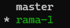
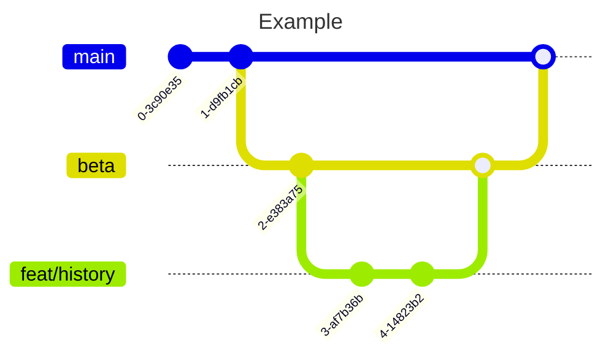
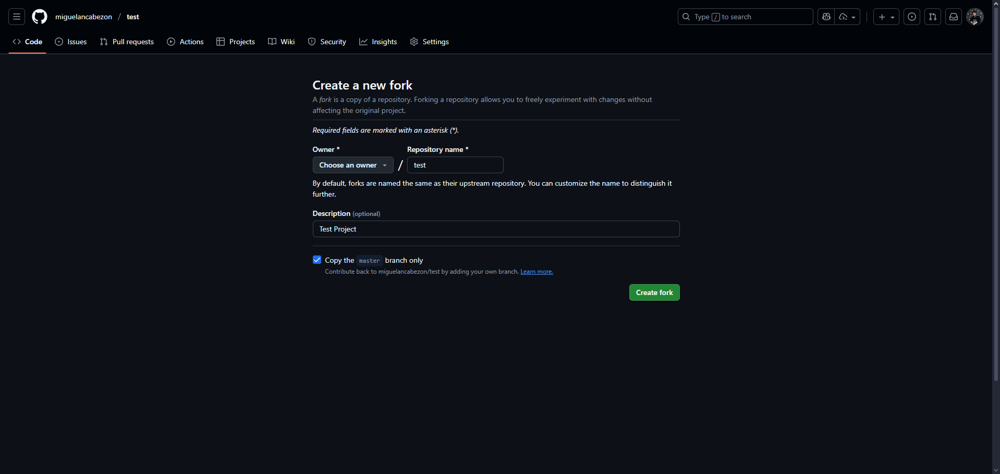

# GIT SEASON 2

## Flowchart

Git organizes its workflow around branches. But what are branches?

**Branches** are independent lines of development that allow you to work on different features or experiments without affecting the main code.

Using a tree as an analogy, we can say that:

- **Main trunk**: The `main` branch contains stable code. It is sometimes called `prod` or `master`.
- **Branches**: Different directions of growth. Examples of branches can be `fix`, `beta`, and `int` (integration).
- **Leaves**: These would be individual commits.
- **Merge**: When a branch is merged back into the trunk.


## Remote Repository

### SSH vs HTTPS

SSH (**Secure Shell**) is the name of a protocol whose main purpose is to connect to a remote server through a secure channel where all information is encrypted.

HTTPS is the **Hypertext Transfer Protocol Secure**, which uses SSL/TLS encryption to establish a secure channel through user authentication and passwords. Nowadays, this protocol is the standard and recommended option for any website or web application.

| Feature | SSH | HTTPS |
| ---------------------- | -------------------------------------------- | ------------------------------------------- |
| Authentication | Public/private key | Username and password (or personal access token) |
| Security | Very secure (uses asymmetric cryptography) | Secure (uses SSL/TLS) |
| Configuration | Requires generating and installing keys | Simpler, no initial configuration |
| Repeated use | Does not ask for credentials every time (uses the key) | May ask for username/token on every push |
| Firewalls/Proxies | May be blocked by some networks | Works almost everywhere (port 443) |
| User experience | Ideal for frequent developers | Better for beginners or occasional use |

### When should you use SSH?

- You are a frequent developer and work with Git every day.
- You want to avoid entering your username/password/token every time. (There is a trick.)
- Your network allows port 22 (used by SSH).
- You have experience configuring SSH keys.

#### Advantages

- More secure in the long term.
- Automatable (for example, in CI/CD scripts).

#### Disadvantages

- Requires initial configuration (keys, SSH agent).

### When should you use HTTPS?

- You are just getting started with Git or use it occasionally.
- You are behind a proxy or restrictive firewall.
- You want a quick and simple configuration.

#### Advantages

- Compatible with almost all networks.
- Easy to use initially.

#### Disadvantages

- May require entering credentials frequently (although you can use a credential helper or token).

---

## REMOTE REPOSITORY

A remote repository is a directory hosted on an online service. It is modified according to the commits made by the developers involved. Many of these services also offer security and management tools that can be adapted to your business or project.

The most well-known ones are GitHub and GitLab, although Google Drive could also technically be considered a remote repository.

To connect the local repository to the remote repository, we first need to create an account on GitHub (which we will use from now on) and create the repository.

Then, from the command line, we run the following command:

`git remote add origin <REPO_URL>`

**Standards note**: The `origin` argument in the command represents the name given to the remote repository. It is good practice to leave it as `origin`. There may also be cases where the main branch of the repository is called `master` or `main` by default (in fact, this is a configurable setting in GitHub).

This is because over the last 10 years there has been a move toward using the name `main` for the main branch for several reasons. First, it provides a default naming standard, although you can also call it `prod`, `stable`, etc. (it all depends on the project). Second, the word `master` has negative cultural connotations.

Now that the remote repository has been configured, we can upload everything stored in commits using the following command:

`git push -u origin main` or simply `git push`

If there are no errors in the terminal, the changes should now be applied to the remote repository.

### THE REVERSE

Now, what happens when we want to create the repository on GitHub and download it to our computer?

Even easier. We simply need to navigate to our project directory through the terminal and type:

`git clone <REPO_URL>`

Once this is done, everything is ready for us to start making changes.

If you made a mistake when setting up the remote repository, you can change the URL as follows:

`git remote set-url origin <REPO_URL>`.

> [!TIP]
> To avoid uploading unnecessary or very large files to GitHub, we can create a `.gitignore` file at the same level as our `.git` folder.
> More information about gitignore [here](https://git-scm.com/docs/gitignore).

### COLLABORATIVE WORK

Imagine that you and your teammate are working on the same branch and the same file. They work in the morning and you work in the afternoon. You know they have uploaded their changes, and now you want to get them locally so you can continue working.

Easy. You just need to run the following command:

`git pull`

The changes will be downloaded to your local repository.

We will cover conflicts in the next lesson.

---

## Branches

So far, we have seen a single branch: the main branch, called *main* or *master* (although we have already seen that it can have other names depending on the project).

However, working on a single branch is dangerous. We could break something that cannot be recovered simply by reverting commits. Or even worse, imagine that your product is a social network and it breaks for a few seconds, causing the entire company to lose several million while the service is unavailable.

For this reason, before developing any feature (or fixing any issue), it is highly recommended — almost mandatory — to create a new branch.

To see the branches we currently have, we can use `git branch`. This will display a list of branches and indicate which one our `HEAD` pointer is currently pointing to (that is, where we are making changes).



To create a branch, we use the command:

`git checkout -b <branch_name>`.

> [!WARNING]
> Keep in mind that the new branch will contain the latest changes from the branch where the `HEAD` pointer is located at the moment the new branch is created.

**Let's look at an example**

> We have two branches: *main* and *beta*.
>
> We want to create a history feature for our beta environment to help developers, so we would run `git checkout beta` (notice that it does not use `-b`).
>
> Now, to start developing, we need to create our new branch with `git checkout -b feat/history`.



To rename a branch, we would use:

`git branch -m <new_branch_name>`.

To delete a branch both locally and remotely, we can use the following commands:

```bash
git push -d <remote_name> <branch_name>   # Deletes the remote branch (remote_name is usually origin)
git branch -d <branch_name>               # Deletes the local branch
```

To change your default branch, you need to change the Git configuration using the following command:

```bash
git config --global init.defaultBranch <branch_name>
```

> [!TIP]
> You can find more detailed information about branches in the Git documentation [here](https://git-scm.com/book/en/v2/Git-Branching-Basic-Branching-and-Merging).

### Types of Branches

#### Environment Branches

These branches are used to separate environments or stages of development.

Examples:

```text
beta
int
dev
```

#### Feature Branches

These branches are used to develop new features or functionality.

Prefix: `feature` or `feat`

Examples:

```text
feature/login-system # Login system
feature/shopping-cart # Shopping cart
```

#### Bugfix Branches

These branches are used to fix bugs in existing code.

Prefix: `bugfix` or `fix`

Examples:

```text
bugfix/mobile-responsive # Responsive design issues
bugfix/database-connection # Database connection error
```

#### Hotfix Branches

These branches are created directly from the production branch to fix critical errors in the production environment.

Prefix: `hotfix/`

Examples:

```text
hotfix/data-corruption # Data corruption
hotfix/server-crash # Server crash
hotfix/memory-leak # Memory leak
```

#### Release Branches

These branches are used to prepare a new production release. They allow you to make final adjustments and polish details.

Prefix: `release/`

Examples:

```text
release/v2.1.0 # Version 2.1.0
release/2024-march # March 2024 release
release/sprint-15 # Sprint 15 release
```

#### Documentation Branches

These branches are used to write, update, or correct documentation, such as README.md files, wikis, or API documentation.

Prefix: `docs/`

Examples:

```text
docs/api-endpoints # Document API endpoints
docs/installation-guide # Installation guide
```

---

## Git merge

We have now completed all our changes in the branch created for the new feature (or fix, or whatever we are working on), so we can add our changes to the main branch.

To do this, we need to perform a **merge**, meaning that we combine one branch with another. We should follow these steps:

**1. Make HEAD point to the target branch**

Let's say we want to include our changes in the main branch (in this example, `main`). First, we switch branches with:

`git checkout main`.

**2. Perform the merge**

We merge the branch where we made our changes (in this example, let's say we developed a payment feature in a branch called `feat/payments`) using:

`git merge feat/payments`.

By default, Git uses the **Fast-Forward** method when performing a merge. This means that the merge is performed without additional commits while preserving the history of the commits made in the source branch.

For more information about merge types, you can check the [documentation](https://www.w3schools.com/git/git_branch_merge.asp?remote=github).

> [!TIP]
> **What happens if we make a mistake during a merge?**
>
> We can use `git merge --abort` to cancel the merge process.

**3. Resolve potential conflicts**

OH, NO! We have a file with conflicts.

We can see which files have conflicts using `git status`, and see what has changed with `git diff`.

When we edit a file containing conflicts, we will see something similar to the following:

```text
<<<<<<< HEAD
Your changes here
=======
Other branch's changes
>>>>>>> feat/payments
```

Between `<<<<<<<` and `>>>>>>>`, we choose the changes we want to keep and remove what we do not want, along with the conflict markers (`<<<<<<<`, `=======`, `>>>>>>>`).

Finally, we stage the changes with:

`git add <resolved_conflict_file>`

and create a commit with:

`git commit -m "<message>"`.

**4. Delete unnecessary branches**

Once the changes have been made and the merge has been completed and resolved, we can delete the branch where we made the changes using:

`git branch -d feat/payments`.

---

## Forking a Repository or Forks

Forking a repository is a way to contribute to repositories that do not belong to you. It creates a copy of a repository where you can make changes without affecting the original repository.

It also allows you to receive the latest changes while working on your forked repository, helping you avoid conflicts in a future merge.



The workflow with remote repositories would be as follows:

1. Create a fork of the original repository.
2. Clone the forked repository into your own environment.
3. Make the necessary changes in your forked repository.
4. Push to your main branch in the forked repository.
5. Create a Pull Request (PR) explaining the changes to the original repository.

This is how many open-source projects are maintained and strengthened.

> [!TIP]
> **PRO TIP**
>
> It is recommended that you add a second remote repository with the URL of the original repository using:
>
> `git remote add upstream <original_repository_url>`
>
> This way, you can download every change made to the original repository.

> [!NOTE]
> You can learn more about open source at the following [link](https://en.wikipedia.org/wiki/Open_source).
