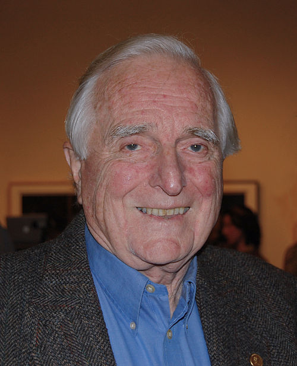

# Ingeniería y Software

# Ingeniería

La ingeniería es una de las disciplinas más antiguas de la humanidad. Cuando nuestros antepasados empezaron a ver los objetos como herramientas y, en definitiva, útiles, el pensamiento lógico ha ido marcando nuestras vidas.

Es una disciplina amplia y cambiante, en parte porque depende en gran medida del avance tecnológico, pero se podría resumir en el usao de principios científicos para diseñar y contruir máquinas, estructuras y otros entes, cómo procesos o software[(1)](#bibliografía).

## ¿Qué significa ser ingeniero?

Ser ingeniero implica en analizar el contexto y objeto de una necesidad social, industrial o económica y diseñar y desarrollar una solución tecnológica, práctica y útil.

Para ello el pensamiento crítico y analítico es clave. A partir de su experiencia (y las experiencias previas de sus predecesores) debe crear soluciones a distintos problemas teniendo en cuenta parámetros tales como el tiempo, los recutsos disponibles, la posibilidad o no de realizarlo, límites, prestaciones o, incluso, aspectos estéticos y comerciales.

### 10 cualidades del buen ingeniero

1. Resolutivo y autosuficiente
2. Pensamiento analítico y lógico
3. Creatividad y mente abierta
4. Aprendizaje continuo
5. Comunicación oral y escrita
6. Trabajo en equipo
7. Detallista
8. Inteligencia emocional y liderazgo
9. Gestión de proyectos, riesgos, cambios y crisis
10. Pensamiento crítico

## ¿Qué ingenierías existen?

Cada ingeniería se separa según su campo de aplicación. Algunas son:

### Ingeniería Militar

Centrada en las actividades de combate y logística de ejércitos en lo referente a la movilidad, contramovilidad y protección.

### Ingeniería Civil

Basada en la ciencia y la tecnología, su motivo de estudio, diseño y desarrollo se enfoca en aspectos como estructuras, construcción, geotecnia, sanitaria, transporte, e incluso ciencias económicas y administativas.

### Derivadas de las Ciencias de la Computación

Aquí entra el diseño y desarrollo de sistemas y procesos digitales y analógicos tales como la computación y telecomunicaciones, entre otras. Aquí entraría la Ingeniería de Software.

Como las ingenierías engloban la mayoría de los aspectos de nuestro mundo actual, aquí tenéis un listado de algunas:

-  Derivadas de las Ciencias de la Conducta
-  Derivadas de las Ciencias Naturales
-  Derivadas de la Economía
-  Derivadas de la Ingeniería Agrícola
-  Derivadas de la Ingeniería Eléctrica
-  Derivadas de la Ingeniería Empresarial
-  Derivadas de la Ingeniería Física
-  Derivadas de la Ingeniería Geológica
-  Derivadas de la Ingeniería Industrial
-  Derivadas de la Ingeniería Mecánica
-  Derivadas de la Ingeniería Química
-  Derivadas de la Matemática

## Algunos ingenieros y sus logros

### Hedy Lamarr [(2)](#bibliografía)

Hedwig Eva Maria Kiesler (1914-2000), fue una actriz de cine e inventora austríaca.
Durante la segunda guerra mundial ayudó a desarrollar manera autodidacta distintas tecnologías militares. Entre ellas, patentó junto al compositor George Antheil, un sistema de comunicación secreto que usaba una pianola para hacer saltos de frecuencia (hasta 88). Esta patente fue utilizada para misiles teledirigidos, para después usarse en el actual Bluetooth y Wi-Fi.

### Lee De Forest [(3)](#bibliografía)

Lee De Forest (1873-1961) fue un inventor estadounidense de con más de 300 patentes.
Entre ellas está el bisturí, el radioteléfono, sistemas de transmisión y recepción de radio, sistemas de comuncación de los trenes, un tipo de altavoz, la celda fotoeléctrica, la cámara de cine a prueba de ruidos, y parte de la televisión y de la televisión en color.

En 1923 mostró en Nueva York por primera vez su sistema de sincronización de sonido en películas, considerandose la primera proyección con sonido. Aunque en su momento la crítica se quejó de la calidad del mismo.

Pero su invento más importante fue en 1906. Su objetivo era el de descubrir un método para amplificar las ondas y al mismo tiempo, controlar el volumen del sonido. Construyó una delgada tira de alambre de platino (a la que dio el nombre de "rejilla"), la dobló en zigzag y la colocó entre el filamento y la placa. Después, encerró todo el aparato en una bombilla de vidrio. Así, inventó el tríodo, uno de los pilares de la electrónica.

### Douglas Engelbart [(4)](#bibliografía)

Douglas Engelbart (1925-2013) fue uno de los inventores que más ha mejorado la vida de los informáticos. En 1967 presentó una patente llamada "indicador de posición XY para un sistema de visualización". Esta patente detallaba un dispositivo conectado por un cable a un ordenador y permitia el movimiento bidimensional de un indicador o cursor que facilitase la navegación por la pantalla. Es decir, un mouse.

Su andadura en la ingenería de la computación también abarcó el surgimiento de las interfaces de comunicación.

### Ada Lovelace [(5)](#bibliografía)

Augusta Ada King, condesa de Lovelace (1815-1852), hija de el famoso poeta británico Lord Byron y de la artistócrata y matemática Anna Isabella Noel Byron (Lady Byron), fue registrada al nacer como Augusta Ada Byron. Cambió su nombre cuando se casó con su mentor, Lord King.

En este entorno científico y creativo, Ada se denominaba a sí misma científica poetisa (también escribía) y fue clave en sus escritos sobre la máquina analítica de Charles Babbage, una de las primeras computadoras y en sus primeros algoritmos.

También supo ver más allá llegando a afirmar que los ordenadores podían hacer más cosas que calcular operaciones con números.

# Software

## ¿Qué es el software?

## ¿Quién lo construye?

## ¿Cómo se construye?

## ¿Cuáles son sus atributos?

## ¿Cuáles son los retos del software?

## ¿Cuáles son sus costos?

# Bibliografía

1.[Wikipedia - Ingeniería](https://es.wikipedia.org/wiki/Ingeniería)
2.[Wikipedia - Hedyy Lamarr](https://es.wikipedia.org/wiki/Hedy_Lamarr)
3.[Wikipedia - Lee De Forest](https://es.wikipedia.org/wiki/Lee_De_Forest)
4.[Wikipedia - Douglas Engelbart](https://es.wikipedia.org/wiki/Douglas_Engelbart)
5.[Wikipedia - Ada Lovelace](https://es.wikipedia.org/wiki/Ada_Lovelace)

