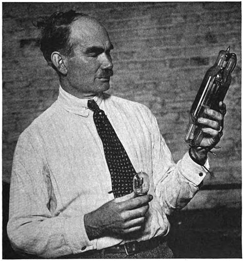
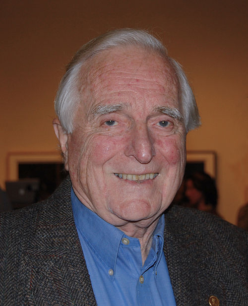

# Engineering and Software

# Engineering

Engineering is one of the oldest disciplines in human history. When our ancestors began to see objects as tools and, ultimately, as useful resources, logical thinking began to shape our lives.

It is a broad and constantly changing discipline, partly because it depends heavily on technological advancement, but it could be summarized as the use of scientific principles to design and build machines, structures, and other entities, such as processes or software[(1)](#bibliography).

## What does it mean to be an engineer?

Being an engineer involves analyzing the context and purpose of a social, industrial, or economic need and designing and developing a technological, practical, and useful solution.

To achieve this, critical and analytical thinking is essential. Based on their own experience (and the previous experiences of their predecessors), engineers must create solutions to different problems while taking into account parameters such as time, available resources, feasibility, limitations, performance, and even aesthetic and commercial considerations.

### 10 qualities of a good engineer

1. Problem-solving and self-sufficiency
2. Analytical and logical thinking
3. Creativity and open-mindedness
4. Continuous learning
5. Oral and written communication
6. Teamwork
7. Attention to detail
8. Emotional intelligence and leadership
9. Project, risk, change, and crisis management
10. Critical thinking

## What types of engineering are there?

Each engineering discipline is classified according to its field of application. Some of them include:

### Military Engineering

Focused on the combat and logistical activities of armies in terms of mobility, counter-mobility, and protection.

### Civil Engineering

Based on science and technology, its field of study, design, and development focuses on areas such as structures, construction, geotechnical engineering, sanitary engineering, transportation, and even economic and administrative sciences.

### Engineering Derived from Computer Science

This field includes the design and development of digital and analog systems and processes, such as computing and telecommunications, among others. Software Engineering would fall under this category.

Since engineering encompasses most aspects of our modern world, here is a list of some of the different fields:

- Derived from Behavioral Sciences
- Derived from Natural Sciences
- Derived from Economics
- Derived from Agricultural Engineering
- Derived from Electrical Engineering
- Derived from Business Engineering
- Derived from Physical Engineering
- Derived from Geological Engineering
- Derived from Industrial Engineering
- Derived from Mechanical Engineering
- Derived from Chemical Engineering
- Derived from Mathematics

## Some Engineers and Their Achievements

### Hedy Lamarr [(2)](#bibliography)

Hedwig Eva Maria Kiesler (1914–2000) was an Austrian film actress and inventor.

During World War II, she independently helped develop various military technologies. Among them, together with composer George Antheil, she patented a secret communication system that used a player piano mechanism to perform frequency hopping (up to 88 frequencies). This patent was used for guided missiles and later became one of the technologies associated with modern Bluetooth and Wi-Fi.

### Lee De Forest [(3)](#bibliography)

Lee De Forest (1873–1961) was an American inventor with more than 300 patents.

Among his inventions and developments were the scalpel, radiotelephone, radio transmission and reception systems, railway communication systems, a type of loudspeaker, the photoelectric cell, the soundproof motion-picture camera, and contributions to television and color television.

In 1923, he demonstrated his sound synchronization system for films in New York for the first time, which was considered one of the first sound-film screenings. However, critics at the time complained about the quality of the sound.

But his most important invention came in 1906. His goal was to discover a method for amplifying waves while simultaneously controlling sound volume. He built a thin strip of platinum wire, which he called a "grid," bent it into a zigzag shape, and placed it between the filament and the plate. He then enclosed the entire apparatus in a glass bulb. Thus, he invented the triode, one of the foundations of modern electronics.

### Douglas Engelbart [(4)](#bibliography)

Douglas Engelbart (1925–2013) was one of the inventors who had a major impact on the lives of computer scientists. In 1967, he filed a patent called "X-Y Position Indicator for a Display System." The patent described a device connected to a computer by a cable that allowed the two-dimensional movement of an indicator or cursor to facilitate navigation on the screen. In other words, a mouse.

His work in computer engineering also contributed to the emergence and development of human-computer communication interfaces.

### Ada Lovelace [(5)](#bibliography)

Augusta Ada King, Countess of Lovelace (1815–1852), daughter of the famous British poet Lord Byron and aristocrat and mathematician Anna Isabella Noel Byron (Lady Byron), was registered at birth as Augusta Ada Byron. She changed her name after marrying her mentor, Lord King.

In this scientific and creative environment, Ada described herself as a poetical scientist (she also wrote creatively) and played a key role through her writings about Charles Babbage's Analytical Engine, one of the earliest computers, and through her early algorithms.

She also managed to look beyond the immediate capabilities of computers, stating that computers could do more than simply perform numerical calculations.

# Bibliography

1. [Wikipedia - Engineering](https://en.wikipedia.org/wiki/Engineering)
2. [Wikipedia - Hedy Lamarr](https://en.wikipedia.org/wiki/Hedy_Lamarr)
3. [Wikipedia - Lee De Forest](https://en.wikipedia.org/wiki/Lee_De_Forest)
4. [Wikipedia - Douglas Engelbart](https://en.wikipedia.org/wiki/Douglas_Engelbart)
5. [Wikipedia - Ada Lovelace](https://en.wikipedia.org/wiki/Ada_Lovelace)
