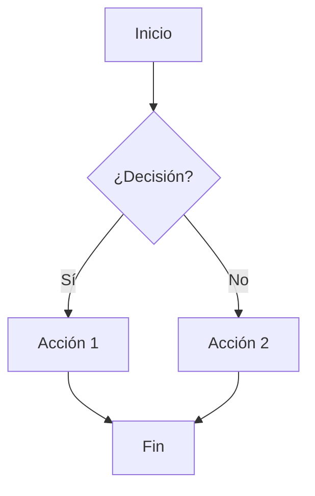
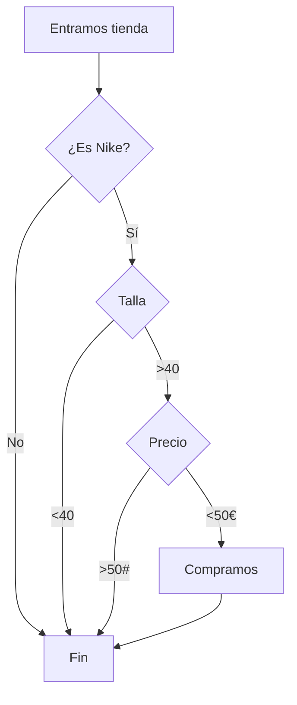
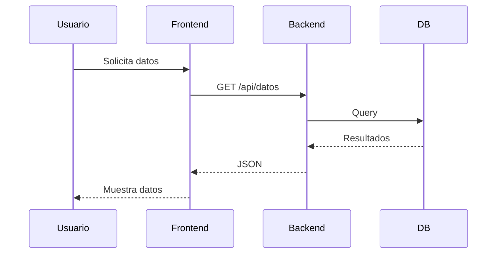
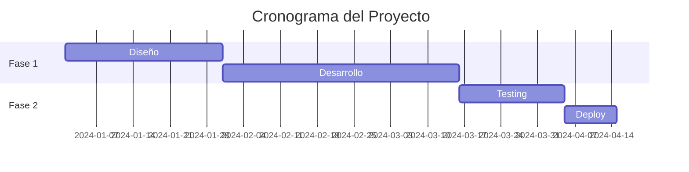
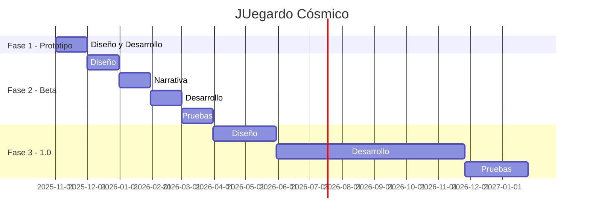
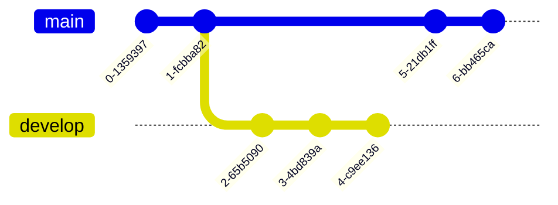
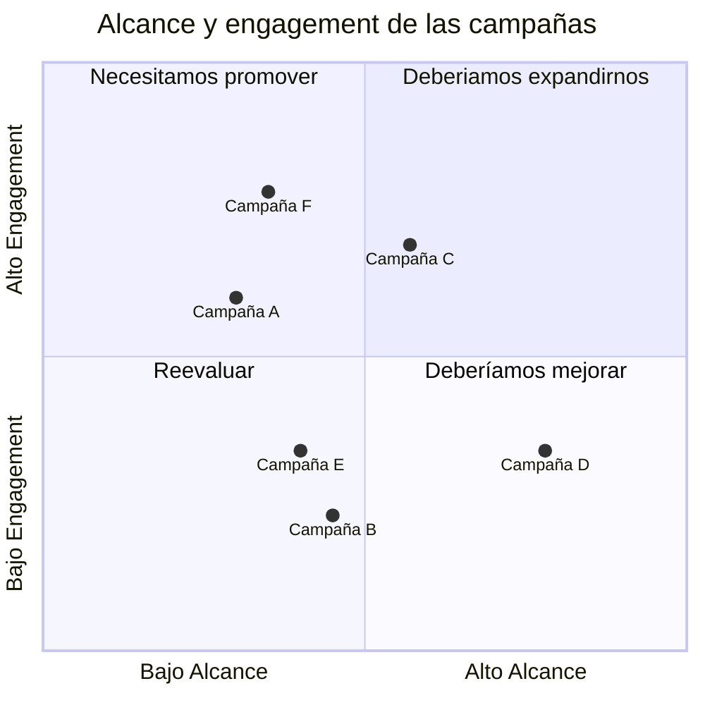
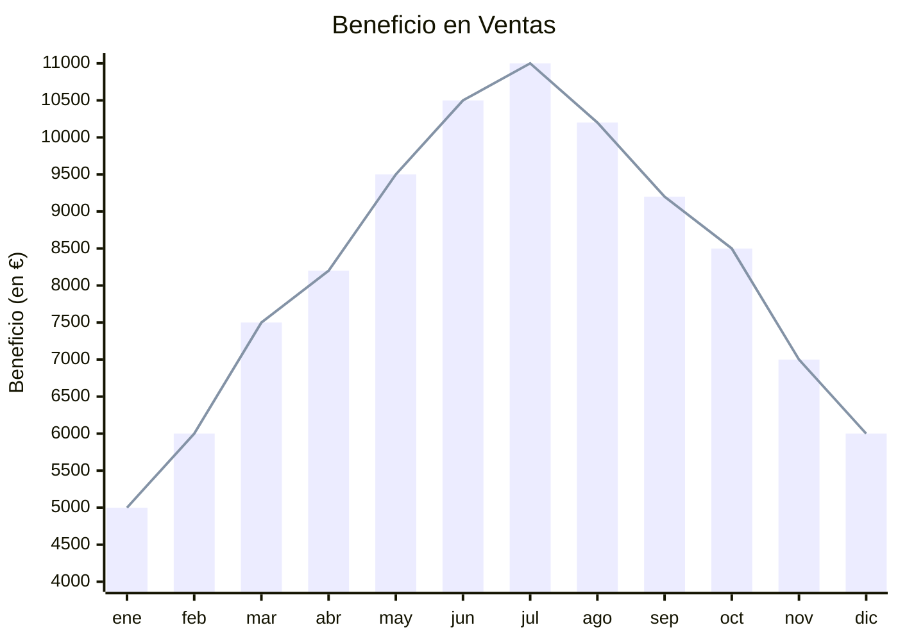

# Markdown - Parte 2
<a id="begin"></a>

<div align="center" height="40">
  

</div>

## Repaso rápido de estilos de Markdown (ver en la pestaña de códgio para saber más)

# Encabezado 1
## Encabezado 2
### Encabezado 3

Texto normal

---

**Negrita** y *cursiva* o _cursiva_
***Negrita y cursiva***

- Lista no ordenada
- Otro elemento
  - Subelemento

1. Lista ordenada
2. Segundo elemento

- [ ] Lista de tareas (solo en GitHub)
- [x] Tarea completada 

[Texto del enlace](https://ejemplo.com "Texto Tooltip")


> Cita en bloque
> Continúa aquí

> [!NOTE]
> Alertas (solo en GitHub)

<!-- Comentario -->

`código en línea`

```
código en bloque
```

| Columna 1 | Columna 2 | Columna 3 |
|:-----------|:-----------:|-----------:|
| Dato 1    | Dato 2    | Dato 3    |
| Dato 4    | Dato 5    | Dato 6    |

<u>Podéis generar tablas de manera sencilla [aquí](https://www.tablesgenerator.com/markdown_tables)</u>

:smile: Emojis (solo en GitHub)

:bug: **Bug Fix**: Corregido problema de memoria :wrench:

:sparkles: **Nueva característica**: Sistema de notificaciones :bell:

[Lista completa de Emojis](https://github.com/ikatyang/emoji-cheat-sheet)


## Bloques de código avanzado

### Formato de sintáxis por lenguaje

```javascript
const saludar = (nombre) => {
    console.log(`¡Hola, ${nombre}!`);
};
```

```py
def fibonacci(n):
    if n <= 1:
        return n
    return fibonacci(n-1) + fibonacci(n-2)
```

```sh
mkdir nueva_carpeta
```

**Ejemplos de errores**

```py
const add = (a, b) => {
  // Codigo Javascript con py en markdown
  console.log("La suma es ", a + b);
}
```


## Formato de tablas avanzado

### Tabla básica

| Columna 1 | Columna 2 | Columna 3 |
|-----------|-----------|-----------|
| Dato 1    | Dato 2    | Dato 3    |
| Dato 4    | Dato 5    | Dato 6    |


### Tabla con alineación

| Columna 1 | Columna 2 | Columna 3 |
|:-----------|:-----------:|-----------:|
| Dato 1    | Dato 2    | Dato 3    |
| Dato 4    | Dato 5    | Dato 6    |


### Tabla con formato interno

| Característica | Descripción | Estado |
|----------------|-------------|--------|
| **API REST** | Comunicación HTTP | ✅ Activo |
| *WebSockets* | Tiempo real | 🚧 En desarrollo |
| `GraphQL` | Consultas flexibles | ❌ Pendiente |


## Enlaces y referencias avanzadas

### Enlaces con referencias

[Texto del enlace][ref1]
[Otro enlace][ref2]

[ref1]: https://ejemplo.com "Título opcional"
[ref2]: https://github.com "Enlace a Github"


### Enlaces automáticos

<https://www.google.com>

### Enlaces a secciones (anclas)

Las anclas se pueden crear con un simpre `#titulo-seccion` en el enlace pero este formato puede dar errores cuando markdown lo quiere interpretar como enlace. Esto puede provocar que se rompa el enlace y no funcione. 
Para evitarlo, podemos usar HTML para añadir un enlace en la sección que quermos:

Colocamos el siguiente elemento HTML dónde queramos tener el ancla:
```html
  <a id="begin"></a>
```

Creamos el enlace en MD:
[Ir al Inicio](#begin)


## Bloques colapsables

<details>
<summary>Click para expandir</summary>

Aquí va el contenido oculto que se muestra al hacer click.
```python
def codigo_oculto():
    return "Se puede incluir código"
```

- También listas
- Y otros elementos markdown

</details>


<details>
<summary>🔍 Información técnica avanzada</summary>

### Subsección dentro del colapsable

Puedes incluir prácticamente cualquier markdown aquí:

| Característica | Valor |
|----------------|-------|
| Performance | Alta |
| Complejidad | Media |

</details>

## Badges

<!-- Badges básicos -->


<!-- Badges dinámicos -->


<!-- Badges de tecnologías -->


<!-- Crear badges personalizados en https://shields.io -->


## Mermaid

[Mermaid](https://mermaid.js.org/intro/ "Enlace a Mermaid") es una herramienta hecha en javascript que renderiza texto en diagramas.

### Diagrama de flujo




### Diagrama de secuencia



### Diagrama de Gantt





### Git Graph



### Gráfica de cuadrantes


### Gráfica de barras



## Rechazar carácteres especiales de Markdown

\# Esto ya no es encabezado 1

\[No es enlace\]
\`No es código\`

Y si queréis poner es barra -> `\\`


## HTML

<!-- Comentarios invisibles en el render -->

<div align="center">
  <h1>Título Centrado</h1>
    <td></td>
</div>

<kbd>Ctrl</kbd> + <kbd>C</kbd> para copiar

<sup>Superíndice</sup> y <sub>subíndice</sub>

<mark>Texto resaltado</mark> (no funciona en todos los parsers)

<table>
  <tr>
    <td>Celda con<br>salto de línea</td>
    <td></td>
  </tr>
</table>


