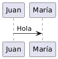
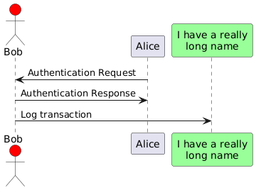
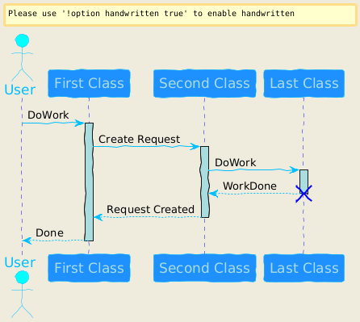
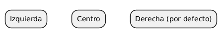
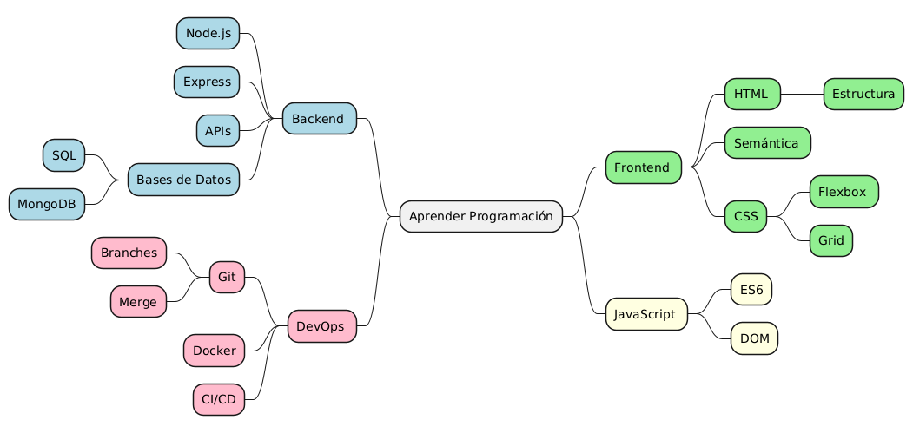
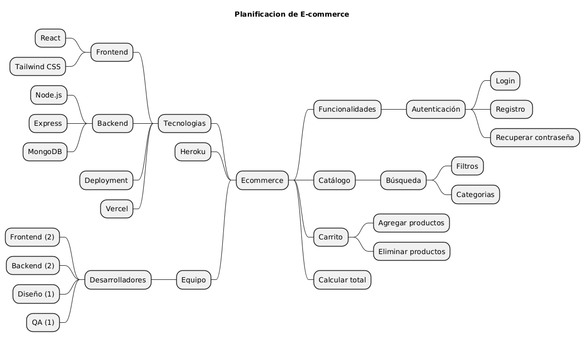
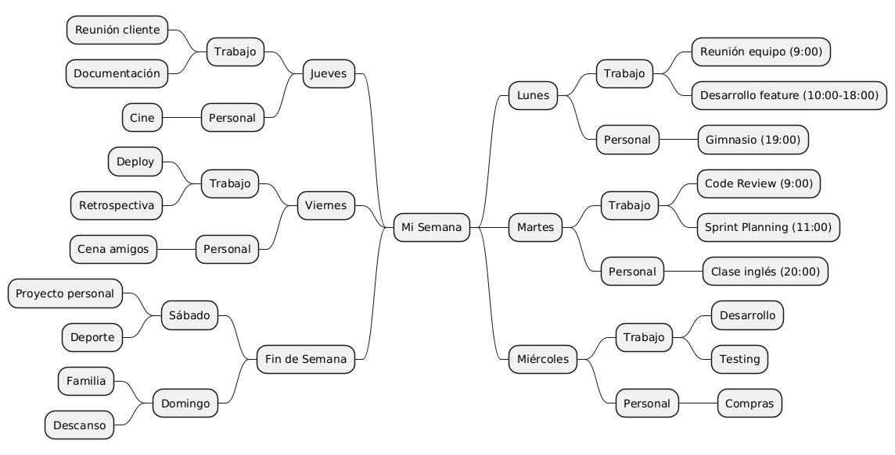
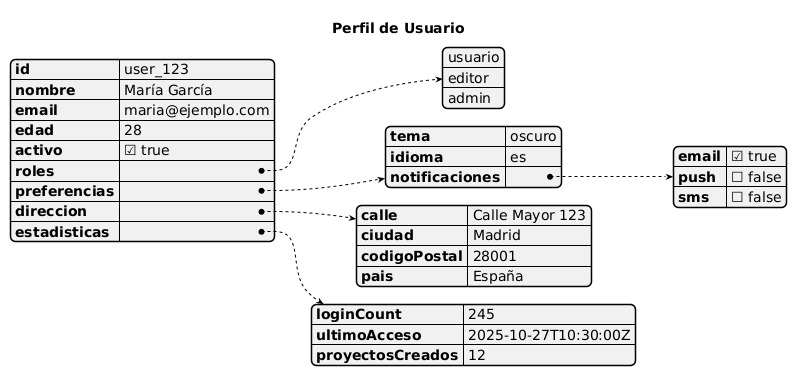
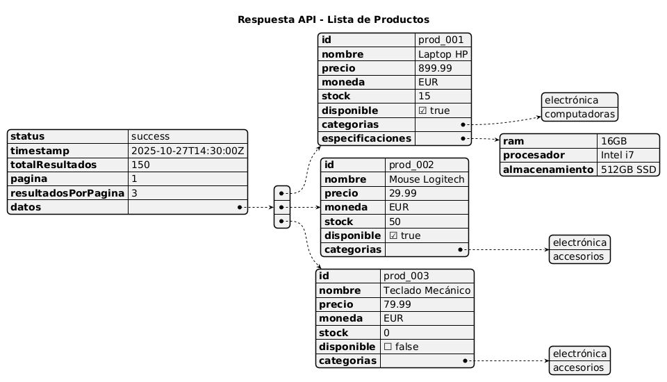
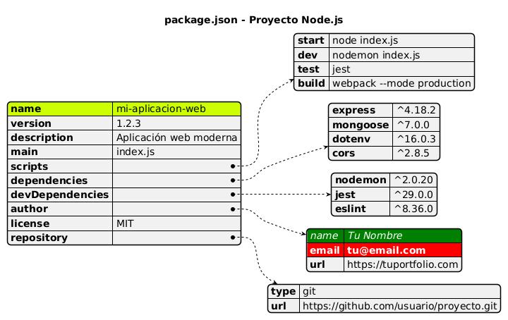

# PlantUML

## ¿Qué es PlantUML?

PlantUML es una herramienta que permite crear diagramas usando un lenguaje de texto simple. En lugar de arrastrar y soltar elementos, escribes código que se convierte en diagramas.
Esta forma de actuar sobre el diseño de un diagrama ayuda a crear diagramas completos de manera más rápida y con menos errores.

Las principales ventajas que tiene, aparte de las dos mencionadas, es que, al tratarse de texto, es fácilmente versionable en Git, porque es rápido de crear y modificar.
De igual manera, usando elementos fijos para crear las variables, conseguimos una consistencia en el estilo y el lenguaje que lo hace fácil de revisar.
Por último, una de las mayores ventajas es que PlantUML es gratuito y [open source](https://github.com/plantuml "Repositorio PlantUML").

### ¿Dónde se usa?

PlantUML es útil en multitud de entornos:

- Documentación técnica
- Planificación de proyectos
- Presentaciones de arquitectura de software
- READMEs de GitHub
- Wikis y documentación

### Configuración del Entorno

#### Opción 1: Online

- [PlantUML Online Server](https://www.plantuml.com/plantuml/uml/SyfFKj2rKt3CoKnELR1Io4ZDoSa70000 "Ir a PlantUML Online Server")
- [PlantText](https://www.planttext.com "Ir a PlantText")

#### Opción 2: Visual Studio Code

Instalar extensión:

1. Abrir VS Code
2. Extensions (Ctrl + Shift + X)
3. Buscar "PlantUML"
4. Instalar "PlantUML" de jebbs

<u>Requisitos:</u>

- O Java instalado (para renderizar localmente)
- O usar servidor online

**Crear primer archivo:**

1. Crear archivo .puml
2. Vista previa en VS Code:
   - Alt + D - Vista previa
   - Ctrl + Shift + P → "PlantUML: Preview Current Diagram"

# Estructura básica

[](../../documentos/modelosUML/primer-uml.puml)

[](../../documentos/modelosUML/puml-basico-ejemplo-2.puml)

[](../../documentos/modelosUML/puml-basico-ejemplo-3.puml)

## Mindmaps (Mapas Mentales)

Los mapas mentales (mindmaps) son diagramas utilizados para plasmar distintas ideas, conceptos, tareas u otros objetos relacionados y sus relaciones.

### Sintaxis básica

[](../../documentos/modelosUML/mindmap/primer-mindmap.puml)

### Direcciones de los elementos

[](../../documentos/modelosUML/mindmap/mindmap-direcciones.puml)

### Ejemplos Prácticos

**Ejemplo 1: Plan de Aprendizaje**

[](../../documentos/modelosUML/mindmap/mindmap-aprendizaje.puml)

**Ejemplo 2: Planificación de Proyecto**

[](../../documentos/modelosUML/mindmap/mindmap-planificacion.puml)

**Ejemplo 3: Organización Personal**

[](../../documentos/modelosUML/mindmap/mindmap-semana.puml)

### Ejercicio Práctico 1

Crear un mindmap sobre uno de estos temas:

- Tu carrera profesional (estudios, habilidades, objetivos)
- Plan de viaje (destino, actividades, logística)
- Estructura de un proyecto personal

Debe tener:

- Al menos 3 ramas principales
- Mínimo 2 niveles de profundidad
- Usar ambos lados (left/right)

---

## JSON Visualizer

JSON (acrónimo de JavaScript Object Notation, 'notación de objeto de JavaScript') es un formato de texto sencillo para el intercambio de datos.

**Ejemplo JSON**

```json
{
  "nombre": "Ana",
  "edad": 30,
  "es_empleado": true,
  "hobbies": ["leer", "caminar", "cocinar"],
  "direccion": {
    "calle": "Calle Falsa 123",
    "ciudad": "Ciudad Ejemplo",
    "codigo_postal": "12345"
  }
}
```

<u>_Tipos de datos_</u>

```json
{
  "string": "texto",
  "numero": 42,
  "decimal": 3.14,
  "booleano": true,
  "nulo": null,
  "array": [1, 2, 3],
  "objeto": {
    "clave": "valor"
  }
}
```

### Ejemplos Prácticos

[](../../documentos/modelosUML/json-visualizer/puml-json-primer.puml)

**Ejemplo 1: Configuración de Usuario**

[](../../documentos/modelosUML/json-visualizer/puml-json-usuario.puml)

**Ejemplo 2: Respuesta de API**

[](../../documentos/modelosUML/json-visualizer/puml-json-api.puml)

**Ejemplo 3: Configuración de Proyecto**

[](../../documentos/modelosUML/json-visualizer/puml-json-proyecto.puml)

### Ejercicio Práctico 2

Crear una visualización JSON para uno de estos casos:

Tu perfil (nombre, edad, habilidades, proyectos)
Datos de un libro (título, autor, páginas, reseñas)
Configuración de aplicación (tema, idioma, opciones)

Debe incluir:

Al menos 5 campos principales
1 objeto anidado
1 array
Diferentes tipos de datos

## Diagramas de Gantt

[Perimer gantt puml](../../documentos/modelosUML/gantt/puml-gantt-primer.puml "Ir a")

**Configurar inicio del proyecto**

[Ir a Configurar inicio del proyecto](../../documentos/modelosUML/gantt/puml-gantt-inicio.puml "Ir a")

**Dependencias entre tareas**

[Ir a Dependencias entre tareas](../../documentos/modelosUML/gantt/puml-gantt-dependencias.puml "Ir a")

**Separadores y secciones**

[Ir a Separadores y secciones](../../documentos/modelosUML/gantt/puml-gantt-secciones.puml "Ir a")

**Hitos (milestones)**

[Ir a Hitos](../../documentos/modelosUML/gantt/puml-gantt-hitos.puml "Ir a")

**Colores y completado**

[Ir a Colores y completado](../../documentos/modelosUML/gantt/puml-gantt-completado.puml "Ir a")

### Ejemplos Prácticos

**Ejemplo 1: Desarrollo de Aplicación Web**

[Ir a Ejemplo 1](../../documentos/modelosUML/gantt/puml-gantt-appweb.puml "Ir a")

**Ejemplo 2: Proyecto Personal - Portafolio**

[Ir a Ejemplo 2](../../documentos/modelosUML/gantt/puml-gantt-portafolio.puml "Ir a")

**Ejemplo 3: Sprint de Desarrollo Ágil**

[Ir a Ejemplo 3](../../documentos/modelosUML/gantt/puml-gantt-sprint.puml "Ir a")

### Ejercicio Práctico 3

Crear un diagrama de Gantt para:

Estudiar para exámenes (4-5 materias)
Organizar un evento (preparativos, invitaciones, día del evento)
Aprender una tecnología nueva (teoría, práctica, proyecto)

Debe incluir:

Al menos 8 tareas
Mínimo 2 secciones
1 hito importante
Usar colores y porcentajes


## Mockups/Salt/Wireframes

[Ir a Base](../../documentos/modelosUML/mockups/puml-wf-primero.puml "Ir a")


**Layout con Grid**

[Ir a Layout con Grid](../../documentos/modelosUML/mockups/puml-wf-grid.puml "Ir a")


**Elementos de formulario**

[Ir a Elementos de formulario](../../documentos/modelosUML/mockups/puml-wf-formulario.puml "Ir a")


**Listas desplegables y scroll**

[Ir a Listas desplegables y scroll](../../documentos/modelosUML/mockups/puml-wf-listas.puml "Ir a")


**Tabs y navegación**

[Ir a Tabs y navegación](../../documentos/modelosUML/mockups/puml-wf-tabs.puml "Ir a")


**Tablas de datos**

[Ir a Tablas de datos](../../documentos/modelosUML/mockups/puml-wf-tablas.puml "Ir a")


### Ejemplos Prácticos

**Ejemplo 1: Formulario de Login**

[Ir a Ejemplo 1](../../documentos/modelosUML/mockups/puml-wf-login.puml "Ir a")


**Ejemplo 2: Dashboard Principal**

[Ir a Ejemplo 2](../../documentos/modelosUML/mockups/puml-wf-dashboard.puml "Ir a")


**Ejemplo 3: Aplicación de Tareas (To-Do)**

[Ir a Ejemplo 3](../../documentos/modelosUML/mockups/puml-wf-todo.puml "Ir a")


**Ejemplo 4: Perfil de Usuario**

[Ir a Ejemplo 4](../../documentos/modelosUML/mockups/puml-wf-perfil.puml "Ir a")


**Ejemplo 5: Configuración de Aplicación**

[Ir a Ejemplo 5](../../documentos/modelosUML/mockups/puml-wf-configuracion.puml "Ir a")


### Ejercicio Práctico 4

Crear un mockup para:

- Formulario de registro (nombre, email, contraseña, términos)
- Página de búsqueda (barra de búsqueda, filtros, resultados)
- Carrito de compras (lista de productos, total, botones)

Debe incluir:
- Título de la página
- Al menos 5 elementos interactivos
- Layout organizado
- Botones de acción
