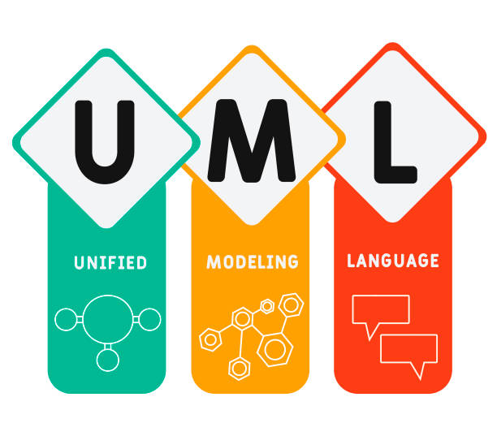

# PlantUML - UML - Parte 1

## Índice
- [¿Qué es UML?](#que-es-uml "Ir a ¿Qué es UML?")
- [Diagrama de Objetos](#diagrama-objetos "Ir a Diagrama de Objetos")
- [Diagrama de Casos de Uso](#diagrama-casos-uso "Ir a Diagrama de Casos de Uso")
- [Diagramas de Estado](#diagrama-estados "Ir a Diagrama de Estado")
- [Recursos](#recursos "Ir a Recursos")
- [Bibliografía](#que-es-uml "Ir a Bibliografía")

---

<div align="center">

</div>

---

## ¿Qué es UML?
<div id="que-es-uml"></div>

UML o Unified Modeling Language o Lenguaje Unificado de Modelado, es uno de los lenguajes de modelado de sistemas de software más conocidos actualmente. Es un lenguaje gráfico para visualizar, graficar, contruir y documentar un sistema en todas sus vertientes. Se usa a modo de plano para diseñar y construir sus funciones, variables, entradas, salidas, procesos...

## Diagrama de Objetos
<div id="diagrama-objetos"></div>

Un **diagrama de objetos** es una representación gráfica de los distintos componentes abstractos de un sistema y la relación entre ellos en un momento dado. Dentro del UML, se establece como un tipo de *diagrama estructural*, dando a entender que gracias a este tipo de diagramas vamos a poder definir la arquitectura de nuestro sistema.

En la programación orientada a objetos (POO), se establece una relación intrínseca entre objetos abstractos y clases programadas. También se pueden utilizar para representar una base de datos.


### Sintáxis básica

Podemos empezar a crear nuestros objetos con la palabra reservada `object`:

```
@startuml
object primerObjeto
object "Mi segundo Objeto" as o2
@enduml
```

### Relaciones entre objetos

|**Tipo**|**Símbolo**|**Finalidad**|
|--------|:-----------:|-------------|
|Extensión|<\|--|Especialización de una clase en una jerarquía|
|Implementación|<\|..|Realización de una interfaz mediante una clase|
|Composición|*--|La parte no puede existir sin el todo|
|Agregación|o--|La parte puede existir independientemente del todo|
|Dependencia|-->|El objeto utiliza otro objeto|
|Dependencia|..>|Una forma más débil de dependencia|

#### Extensión

Explicación

Ejemplo

#### Implementación

Explicación

Ejemplo 

#### Composición

Explicación

Ejemplo 

#### Agregación

Explicación

Ejemplo 

#### Dependencia

Explicación

Ejemplo 


Adicionalmente, se puede **añadir una etiqueta a la relación** con `:` y la cardinalidad se puede añadir entre comillas `""` al lado que quieras de la relación.

```
@startuml
object Objeto01
object Objeto02
object Objeto03
object Objeto04
Objeto01 o-- "4" Objeto02
Objeto03 .. Objeto04 : Etiqueta
@enduml
```


Para saber más sobre los diagramas de objetos, podéis ver más en la documentación oficial -> [Enlace](https://plantuml.com/es/object-diagram "Ir a PlantUML - Diagrama de Objetos")

---

## Diagrama de Casos de Uso
<div id="diagrama-casos-uso"></div>

Para saber más sobre los diagramas de casos de uso, podéis ver más en la documentación oficial -> [Enlace](https://plantuml.com/es/use-case-diagram "Ir a PlantUML - Diagrama de Casos de Uso")

---

## Diagramas de Estado
<div id="diagrama-estados"></div>

Para saber más sobre los diagramas de estado, podéis ver más en la documentación oficial -> [Enlace](https://plantuml.com/es/state-diagram "Ir a PlantUML - Diagramas de Estado")

---

## Recursos
<div id="recursos"></div>
- [Editor PlantUML Online](https://shorturl.at/elELo)
- [Editor PlantUML Oficial](https://editor.plantuml.com)


## Bibliografía
<div id="bibliografia"></div>
- [Guía de Referencia de PlantUML](https://pdf.plantuml.net/PlantUML_Language_Reference_Guide_es.pdf)


