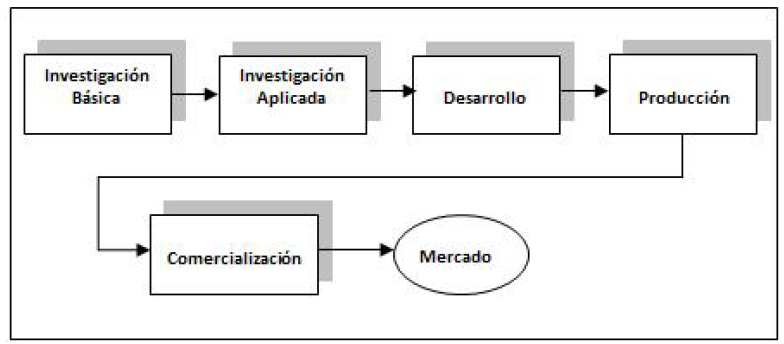
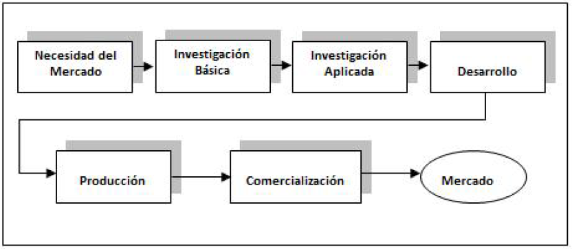
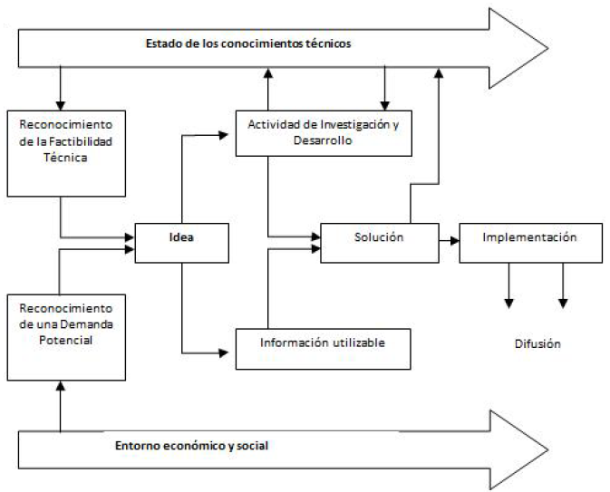
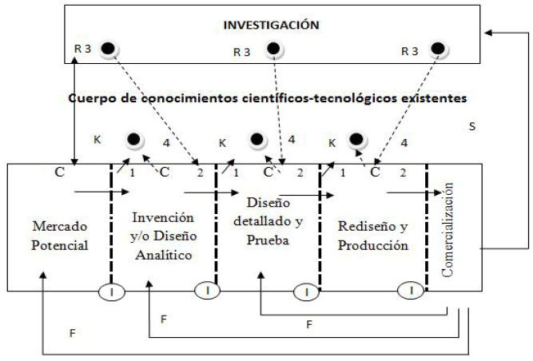
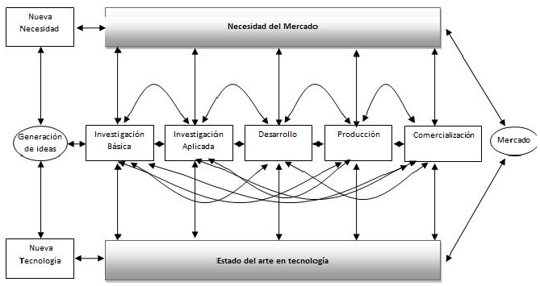
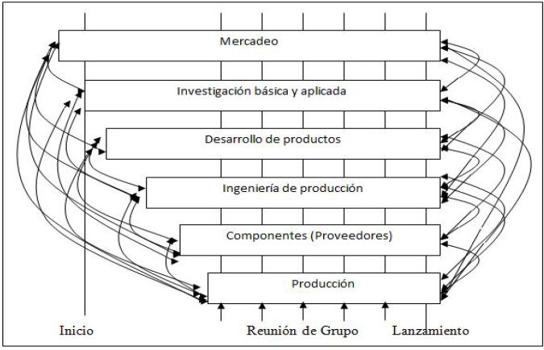
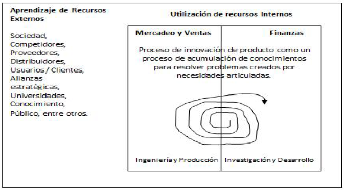

# Innovación

## Índice
- [¿Qué es la Innovación?](#innovacion "Ir a ¿Qué es la Innovación?")
  - [Ejemplo - Videoclub vs Streaming](#ejemplo "Ir a Ejemplo - Videoclub vs Streaming")
- [Modelos](#modelos "Ir a Modelos")
  - [Primera Generación](#gen1 "Ir a Primera Generación")
  - [Segunda Generación](#gen2 "Ir a Segunda Generación")
  - [Tercera Generación](#gen3 "Ir a Tercera Generación")
  - [Cuarta Generación](#gen4 "Ir a Cuarta Generación")
  - [Quinta Generación](#gen5 "Ir a Quinta Generación")
- [Esquemas de Innovación](#esquemas "Ir a Esquemas de Innovación")
  - [Individual](#individual "Ir a Individual")
  - [Incremental](#incremental "Ir a Incremental")
  - [Disruptiva](#disruptiva "Ir a Disruptiva")

## ¿Qué es la Innovación?

Es un proceso que tiene como objetivo la creación de un producto nuevo o la modificación de uno existente y su introducción en el mercado.

Por suerte o por desgracia, todo está inventado y nada es nuevo. Todo se basa en otra cosa y se construye una encima de otra.
Es por eso que los procesos como el brainstorming son esenciales para el surgimiento de nuevas ideas.

El **brainstorming** es un proceso de recopilación de ideas que se caracteriza por su rapidez y falta de filtrado. Durante este proceso se valora generar una gran cantidad de ideas, preferiblemente variadas y originales, que permitan encarar cualquier desafío desde todos los puntos de vista posibles.

Durante una sesión de brainstorming se apunta toda idea surgida sin prejuicio ni escrutinio alguno (quizá los más básicos) y se evalúa su validez al final de la sesión de manera objetiva y argumentada.

### Ejemplo - Videoclub vs Streaming

|Videoclub|vs|Streaming|
|---|:---:|---|
|Tiendas físicas|<->|Desde casa|
|Producto físico|<->|Producto digital|
|Tiempo definido de reserva|<->|“Es tuyo” mientras lo pagues|
|Diversificación|<->|Solo productos digitales (películas y series principalmente)|
|Número limitado de catálogo|<->|Catálogo “ilimitado”|
|Número limitado de reservas|<->|Puedes un número ilimitado de veces|
|Puede alquilar quien quiera|<->|Puede contratarlo gente con tarjetas/cuentas bancarias|
|No pueden alquilar lo que quieran|<->|Cualquiera puede ver cualquier cosa (aunque ahora hay perfil para niños)|

## Modelos

Un modelo de innovación busca proyectos deseables por el público (target), técnicamente factibles y que devuelvan un retorno lucrativo (que sean económicamente viables).

### Primera Generación

Modelos que toman los procesos llevados a cabo durante las guerras mundiales y se establecen en el mundo empresarial entre los 50 y 60, donde se consideraba que el cambio tecnológico dependía en gran medidad de la existencia del cúmulo de conocimientos científicos obtenidos a través de la invesitgación básica; llevando a las organizaciones (tanto públicas como privadas) a requerir talento humano científicamente calificado

#### Modelo Technology-Push

Este modelo, desarrollado por Roy Rothwell, presenta las siguientes limitaciones: 
- Observa la innovación tecnológica como un proceso racional que puede ser planificado, programado, controlado y desagregado en actividades independientes para simplificar su gestión.
- Otorga mucha importancia a la I+D como desencadenante del proceso innovativo.
- Desconoce que la tecnología dispone de una estructura de conocimientos propios que fueron obtenidos y acumulados durante mucho tiempo a través de la observación empírica.

En consecuencia, se produce la creencia de que el proceso de innovación tecnológica debe comenzar sí o sí por la investigación básica. Cuando pueden surgir innovaciones a través de aprovechar los resultados de investigaciones aplicadas existentes.

### Segunda Generación

#### Modelo Market-Pull

En este modelo, también desarrollado por Rothwell durante los años 60, se toma en cuenta las necesidades del público o cliente, consiguiendo un aproximamiento más cercano a la realidad. Con el cliente como generador principal de ideas, el departamento de I+D se convierte en un mero agente reactivo, aunque después tenga un papel esencial en el desarrollo y mejora de productos y procesos.

#### Modelo Marquis

El *modelo Marquis* se basa en que, parte de las ideas que desencadenan el proceso innovador **no proceden necesariamente del departamento de investigación y desarrollo**, sino que pueden emanar de cualquier departamento de la organización: comercialización, ingeniería, comercialización, entre otros

Uno de los principales aportes de este modelo, es el hecho de que las ideas que llevan a la innovación tecnológica provienen en medio de un contacto permanente entre las diferentes áreas de la organización.

#### Modelo Kline

 Por otra parte, Kline, critica el modelo lineal y propone un modelo denominado cadena – eslabón que trata de incorporar la complejidad del proceso innovador. Este modelo está estructurado con cinco rutas que conectan las tres áreas más relevantes del proceso innovador (la investigación, el conocimiento y la cadena central del proceso de innovación tecnológica), y estas son:

### Tercera Generación

A mediados de los 80, Rothwell (junto a un tal Zegveld) vuelve a la carga con un nuevo modelo (el Modelo Mixto) que consiste en una serie de etapas secuencialmente lógicas (pero no necesariamente consecutivas) y que puede ser divididas en series funcionalmente distintas pero ***con etapas interdependientes e interactivas entre sí***. Esto representa una red compleja y extensa de canales de comunicación, tanto internos como externos a la empresa, que unen las diferentes fases del proceso innovativo entre sí. Así, conseguimos que el proceso de innovación esté basado en las capacidades tecnológicas, las necesidades del mercado y el potencial de la empresa.

#### Modelo mixto

### Cuarta Generación

#### Modelo integrado de procesos

### Quinta Generación

#### Modelo en Sistemas y en Red

## Esquemas de Innovación

### Individual

### Incremental

### Disruptiva

## Bibliografía 
- [Modelos de Innovación](https://www.redalyc.org/journal/290/29055964004/html/ "Ir a más info sobre Modelos de Innovación")

